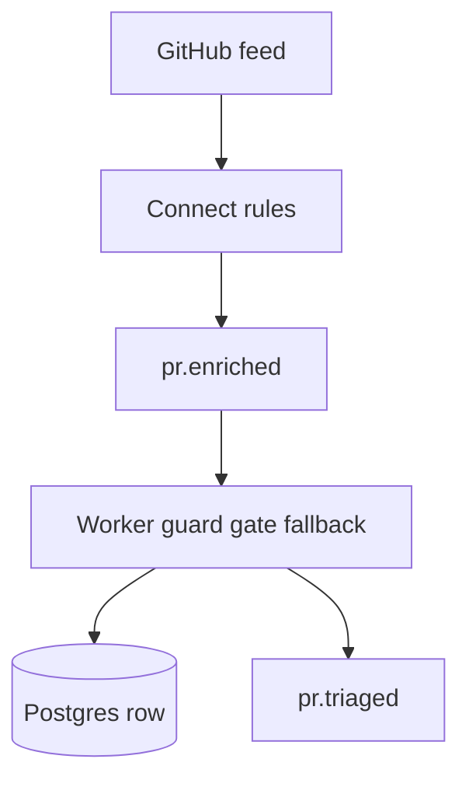
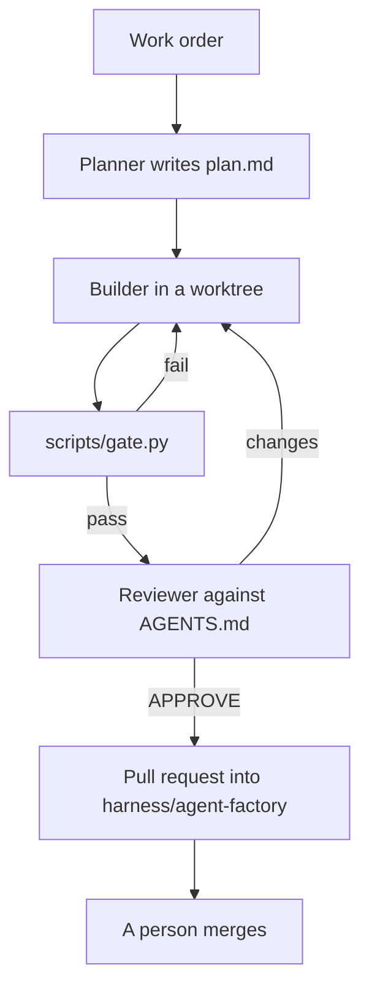
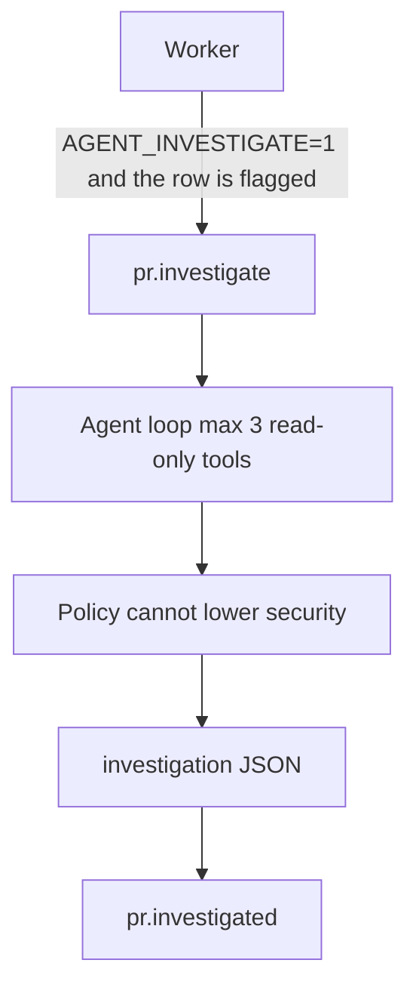
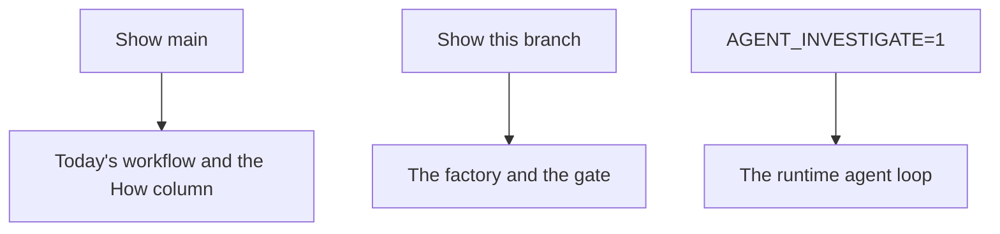

# Agent factory

`main` is the interview demo. It is a workflow: Connect filters, the worker decides every branch, the model only judges. This branch adds a factory around that workflow and four changes the factory was aimed at. Nothing here merges itself.

## Today's workflow

The model has no tools. `label_source` says whether the row came from the model, a retry, a give-up, or a skip.

## The factory

`factory/run.py` calls `AGENT_CMD` (default `cursor-agent -p`, or `claude -p`). It stops after three rounds and writes an escalation. It does not merge, and it does not push `main`.

## The runtime agent

With the flag off, the worker does not publish and `docker compose up` does not start the investigator. The service is behind the compose profile `investigate`.

Tools are `read_file`, `list_changed_files`, and `osv_lookup`. A tool failure stores `investigation.status=failed` and leaves the category alone.

## When to show which picture

Show `main` for the product as it runs today. Show this branch for how a change is planned, gated, and reviewed. Show the runtime loop only with the flag on. The flag-off stack is the same demo as `main`, plus topics that nothing publishes to.

## Eval

Recorded workflow, then the floor on those same rows. The floor patterns were written knowing `f001`, `f003`, `f006`, and `f012`. A perfect floor score is the rules firing, not a blind test. The agent rows are scripted: they replay the floor label through the tool loop so tool calls and label flips are measurable without a hosted model. A hosted run is `LLM_PROVIDER=anthropic`.

| Run | Correct | Security recall | Tool calls | Label flips |
|---|---|---|---|---|
| workflow | 9/12 | 1/4 | 0 | 0 |
| workflow+floor | 12/12 | 4/4 | 0 | 0 |
| agent, scripted | 12/12 | 4/4 | 1 per non-skipped fixture | 0 |
| floor+agent, scripted | 12/12 | 4/4 | 1 per non-skipped fixture | 0 |

False raises on the floor: 0. `f010`, the `x/crypto` version bump, stays `dependency-bump`.

`python scripts/gate.py` writes `gate.json` and fails if tests fail, if security recall drops below `evals/baseline.json` (0.25 for the recorded workflow), or if the floor's security recall drops below 1.0 or its false raises rise above 0.

## What the factory automated, and what stayed a person

Automated: the work-order file, the three role prompts, the gate, and opening a pull request whose body carries the plan and `gate.json`.

Stayed a person: merging. Writing the security patterns against fixtures that were already labelled. Deciding that `unclear` is still only the worker's word. Taking over after three failed rounds.

`cursor-agent` was not on PATH in the session that built the four changes. Those changes were made in that session, on these branches, and `factory/run.py` is what a later run uses when the headless agent is installed. The run notes under `factory/runs/` say that.

## What agents did not fix

GitHub's anonymous rate limit still stalls the poll. Connect's dedupe memory still dies with the container. The confidence gate still sits on a self-reported score that this model puts near 0.85 even when the label is wrong. The floor is the fix for the labels the score would not question. The agent does not repair those three.
