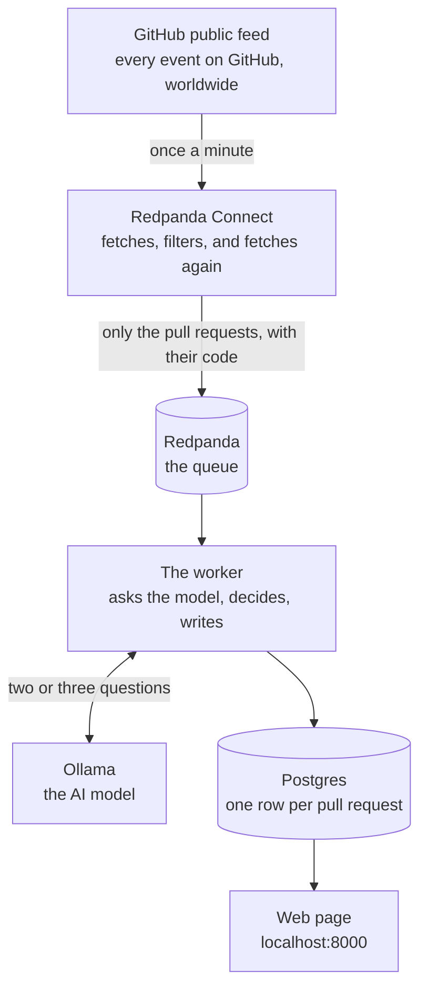
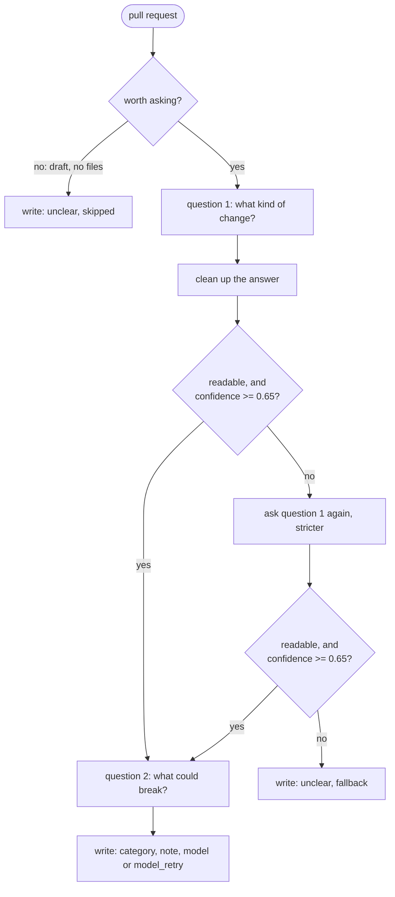

# How this works

This system watches for new pull requests on GitHub, reads the actual code that changed,
and sorts each one into a category (security, feature, refactor, docs or dependency
bump), adding on top of that a short risk note a human can act upon.

Every section below covers one component, and for each of them the decision I made, the
alternative I didn't take, and the condition that would make me flip. The code links go
straight to the file on GitHub.

## The picture



GitHub publishes everything that happens, Connect throws most of it away and fetches the
code for whatever is left, and the queue holds those results until the worker is ready.
The worker asks the model what kind of change it is and writes the answer down, and the
web page shows it.

---

## 1. GitHub's public feed

The feed at `https://api.github.com/events` is a public list of everything happening on
GitHub right now, giving you roughly 100 items per request with no login needed, and it's
the only source of data here.

**The decision: polling a public feed rather than webhooks.** For a new pull request the
feed hands you five fields, `id`, `number`, `url`, `base` and `head`, and nothing else, so
the pipeline polls once a minute and fetches everything else itself. I measured this over
52 pull request events and every single one had exactly those five keys.

**Why it matters.** It costs one request a minute whether anything happened or not, and
since the feed is a moving window of recent events, anything that happened while the
pipeline was down is simply gone. There's no replay, which for a compliance tool is the
uncomfortable part.

**When I'd flip it.** For any real deployment, straight away. Webhooks push each event as
it happens, which removes both the wasted requests and the gap during downtime. The only
reason this polls is that webhooks need a public endpoint and a repository you control,
while the exercise asked for a public source with no signup.

**Cheaper than flipping**, and worth doing either way: GitHub returns an `ETag` with each
response, and sending it back as `If-None-Match` means an unchanged feed replies "nothing
new" without counting against the hourly limit.

[connect/ingest.yaml](https://github.com/pablogd-hashi/rp-ghtriage/blob/main/connect/ingest.yaml#L11),
lines 11 to 30.

---

## 2. Redpanda Connect

Connect is configured with a settings file rather than code, and here it does everything
between GitHub and the queue: poll, drop what isn't a new pull request, drop the bots,
remember what it has already seen, fetch the pull request and its changed files, trim the
result and route it.

Measured over 220 real events, 44 were pull request events, 20 of those were new ones
(the rest being merges and label changes), 2 were bots, and 18 survived. That's roughly
92% thrown away before any fetching or thinking happens.

**The decision: enrichment in the Connect config rather than in the Python worker.** The
fetching and reshaping sits in the config, which means the queue holds records that are
already useful to anyone reading them rather than only to this one worker, and the worker
never spends a GitHub request itself.

**Why it matters.** It hides its own failures. If GitHub times out on the file fetch, the
record keeps flowing with a title but no code, because the dead-letter check only catches
the case where the title *and* the files are both missing. So a pull request with a title
and no code gets through, and the model ends up judging a security change on a title
alone, which is exactly the thing this system exists to avoid.

**When I'd flip it.** If silent enrichment failures turned out to be common rather than
rare, or in any environment sensitive enough that they can't be tolerated. In the Python
worker I'd catch the HTTP timeout, retry with cleaner error handling and mark the record
as failed explicitly, rather than inferring failure from fields that happen to be empty.

**Cheaper than flipping.** Connect already knows the fetch failed, as it sets an error
flag, so switching the output on `errored()` instead of on empty fields fixes the same
problem without moving anything.

Two more things worth knowing. The memory of what it has seen lives in RAM and dies with
the container, so a restart re-fetches whatever is still inside GitHub's window, and two
copies of Connect would each spend the same requests on the same events. And the trim
keeps the first 8 files in whatever order GitHub returned them, so a pull request
changing nine files where the ninth touches authentication simply loses that file, which
a risk-weighted sort before cutting would fix.

[connect/ingest.yaml](https://github.com/pablogd-hashi/rp-ghtriage/blob/main/connect/ingest.yaml):
the fetches are the `branch:` blocks at lines 78 and 101, the trim is the `mapping:` at
126, the routing is `output:` at 155.

---

## 3. Redpanda, the queue and its three lanes

The queue sits between Connect and the worker, so Connect puts enriched pull requests on
it and the worker takes them off one at a time. There are three lanes, which Redpanda
calls topics:

| Lane | What goes on it | Who reads it |
|---|---|---|
| `pr.enriched` | Pull requests with their code, ready to be judged | The worker |
| `pr.triaged` | Pull requests with their judgement attached | Nothing yet. It exists so something could |
| `pr.dlq` | Things that failed. "Dead letter queue" | Nothing. A human, with `task consume -- pr.dlq` |

**The decision: a log between the fetcher and the worker rather than calling the worker
directly.** Connect fetches far faster than the model can think, as the model takes
roughly 90 seconds per pull request so one worker gets through about 39 an hour, and the
queue absorbs that difference.

**Why it matters.** Without it you get one of two bad outcomes: either Connect waits for
the model and falls behind GitHub, missing events entirely, or Connect runs ahead and the
worker drops whatever it couldn't keep up with. With the queue in place an outage becomes
a delay rather than a loss, because if the worker dies the work simply waits, and that's
the entire reason a broker is here at all.

**When I'd flip it.** At a volume low enough that a cron job and a database table would
do, the broker is overhead. That isn't this: the mismatch between fetch speed and model
speed is roughly ten to one, and it's measurable.

**Scaling it.** One worker reads the queue today, and when the queue grows faster than it
drains the answer is more workers. The lane has one partition, so that means adding
partitions for each worker to take a share, which is a config change rather than a code
change.

Created at
[docker-compose.yml](https://github.com/pablogd-hashi/rp-ghtriage/blob/main/docker-compose.yml#L48).

---

## 4. Ollama, the model

Ollama runs language models on your own machine for free with no account, and the model
here is `qwen2.5:3b`. It answers two questions per pull request: what kind of change this
is and how sure it is, then, only if the first answer came back confident, which part of
the system this touches and what could break.

**The decision: a small local model by default, with a hosted one behind an env var.**
Anyone can run this with `docker compose up` and no API keys at all, and a hosted model
is one line in `.env`.

**Why it matters.** It's the biggest weakness in the whole system and it's worth being
blunt. The recorded results score 9 out of 12, and the three misses are all pull requests
written to mislead: "bump deps" while the code disables token expiry, "small cleanup"
while it fixes SQL injection, "fix typo" while it opens a security setting to the whole
internet. The model went with the title all three times, at 80 to 90 percent confidence.

The part that really stings is that on all three the model's *second* answer, the "what
could break" note, correctly named the problem. The note for "fix typo" says the change
may expose the gateway to any origin, while the label above it says `refactor`. In other
words the model saw it, but only the first answer decides the label, so the finding
landed in a text column and changed nothing.

**When I'd flip it.** For a customer, immediately, with the hosted model as the default
and the local one as the fallback. A 3B model on a laptop is the right choice for a demo
anyone can run and the wrong choice for anything that matters.

**Cheaper than flipping, and better.** The fix isn't a bigger model, it's a rule that
runs before the model and can only raise the alarm, never lower it. If the path contains
`auth`, `cors`, `middleware` or `secret`, or the code contains `verify_exp: False` or
`allowed_origins: "*"`, the label becomes `security` and the model's job narrows to
explaining why. Rules are good at floors and models are good at explanations, and this
design currently has them the wrong way round for the one category that matters most.

Prompts in
[triage/prompts.py](https://github.com/pablogd-hashi/rp-ghtriage/blob/main/triage/prompts.py),
client in
[triage/llm.py](https://github.com/pablogd-hashi/rp-ghtriage/blob/main/triage/llm.py).

---

## 5. The worker

About 140 lines of Python that read from the queue, decide what to do with each pull
request and write the result down. This is the part worth reading if you only read one
file.

For each pull request it checks whether it's worth asking at all, asks the model the
first question, cleans up the answer, decides whether to trust it, asks the second
question only if it does, then writes the row and only afterwards tells the queue it's
done.

Every row records which of those paths it took:

| `label_source` | What happened |
|---|---|
| `model` | First answer, trusted. The normal case |
| `model_retry` | First answer was unusable or unsure. The stricter retry worked |
| `fallback` | Both attempts failed. Wrote "unclear" rather than guessing |
| `skipped` | Never asked the model. Draft, or nothing to read |



**The decision: a multi-step loop rather than one comprehensive prompt.** A first call
classifies and scores confidence, a gate decides whether to trust it, a stricter retry
runs when it doesn't, and a second narrower call produces the risk note using only the
files the first call named as evidence.

**Why it matters.** The second question only makes sense if the label is right, because
attaching a confident-sounding risk note to a wrong label is worse than having no note at
all, as someone will skim the note and believe the label. Splitting them also keeps each
prompt small, which matters a great deal for a 3B model.

**When I'd flip it.** Moving from a local model to a capable hosted one. Large hosted
models follow a JSON schema reliably enough that the retry path becomes dead code, and at
that point the network round-trip dominates, so one comprehensive call is both faster and
cheaper.

**The confidence gate is doing less than it looks.** In practice this model reports 0.85
or higher on almost everything, including the answers it gets wrong, so the gate at 0.65
almost never fires and the retry is triggered by unreadable answers rather than by
uncertainty. A better signal would be something the model can't inflate, as in whether
the files it names as evidence actually exist in the diff.

**Two decisions that aren't tradeoffs, just correctness.** The worker waits for the model
before consuming anything, because an earlier version consumed while the model was down,
wrote "unclear" and marked them done, which permanently lost those pull requests as
GitHub doesn't re-emit the event. And it marks a message done only after the database
write, so a crash halfway through means redelivery rather than loss.

**Where it breaks.** A database outage does completely the wrong thing. Every pull request
after it fails at the write step, goes to the dead-letter lane and gets marked done, so
when Postgres comes back the worker has a dead connection and an empty queue. The code
treats "the database is down" identically to "this message is broken", when a broken
message should be parked and a down dependency should make the worker wait and reconnect.

[worker.py](https://github.com/pablogd-hashi/rp-ghtriage/blob/main/worker.py),
[triage/reason.py](https://github.com/pablogd-hashi/rp-ghtriage/blob/main/triage/reason.py)
(marked `SEAM 1`, `SEAM 2` and `SEAM 3`).

---

## 6. Cleaning up the model's answer

Sixty lines that turn whatever the model said into something the code can use, which
makes it the riskiest code in the project, due to being the one place where free text
from an AI becomes structured data that gets stored.

**The decision: parse and validate in Python rather than in the Connect config.** Connect
could strip a fence and pull out the first `{...}` block perfectly well, but a bad answer
has to trigger a *different question*, and that's the thing a config can't express.

**Why it matters.** The rule the file follows is fix formatting, never fix meaning. A
trailing comma is formatting, whereas turning "banana" into "unclear" would be inventing a
judgement the model never made, so the code refuses the answer and the worker asks again.
That's also why "unclear" is off-limits to the model and reserved for the worker to write
when it gives up, which means an unclear row always says the pipeline couldn't decide
rather than the model shrugged and we accepted it.

**When I'd flip it.** If the model were reliable enough that a default label on bad output
were acceptable and no retry were needed, the whole thing collapses into a Bloblang
mapping and belongs upstream.

**Two repairs that can misfire.** The trailing-comma fix removes any comma before a
closing brace including one inside a quoted string, which is a value change and the one
thing this file promises not to do. And the curly-quote fix can end a string early and
break an answer that was fine, costing a whole extra model call. Both go away by trying
`json.loads` first and only repairing on failure.

[triage/parse.py](https://github.com/pablogd-hashi/rp-ghtriage/blob/main/triage/parse.py),
tested in
[tests/test_parse.py](https://github.com/pablogd-hashi/rp-ghtriage/blob/main/tests/test_parse.py).

---

## 7. Postgres

One table, one row per pull request, written by a single statement, and read by the web
page.

**The decision: the worker writes to Postgres directly rather than Connect sinking a
topic.** The worker owns the write, and it commits the queue offset only afterwards.

**Why it matters.** Two reasons. The `label_source` and the reason behind a fallback have
to land atomically with the decision that produced them, and routing through a topic and
a sink adds a hop where that provenance gets separated from its judgement. And it keeps
credentials in one place, since Connect only ever needs a GitHub token.

**When I'd flip it.** If several systems needed the results rather than one web page, a
topic plus a Connect sink starts paying for itself.

**The write is an upsert, and that cuts both ways.** The same pull request legitimately
arrives more than once, as the feed overlaps minute to minute, Connect's memory dies on
restart and a worker crash replays the message, so a plain insert would either crash or
duplicate. But letting the newest write always win is wrong in the other direction: if the
model is down and a pull request gets re-run, "unclear" replaces the correct answer that
was already there. The fix is a `WHERE` clause:

```sql
WHERE EXCLUDED.label_source IN ('model', 'model_retry')
   OR pr_triage.label_source IN ('fallback', 'skipped')
```

A real answer can replace anything, a gave-up can only replace another gave-up. That
isn't written yet, and it's the first thing I would add, because the retry job in section
5 is unsafe without it.

[db/schema.sql](https://github.com/pablogd-hashi/rp-ghtriage/blob/main/db/schema.sql),
[triage/store.py](https://github.com/pablogd-hashi/rp-ghtriage/blob/main/triage/store.py#L26).

---

## 8. The web page and the seed

A single page at `localhost:8000` showing the table newest first with a filter by
category, plus a JSON version at `/api/results`. A small program also runs once at
startup and puts twelve already-classified pull requests into the database.

**The decision: serve it from the database rather than from the topic.** The web layer
reads rows, it doesn't consume or reason, so the reasoning service is a worker rather than
something the page invokes.

**Why it matters.** The page stays responsive regardless of how slow the model is, and
long-term storage comes for free, so you can look at how classifications changed over
time. The seed exists because new pull requests are roughly 2 in every 100 events and the
model takes 90 seconds each, which would leave `docker compose up` showing an empty table
for several minutes. The rows are a recording of a real earlier run rather than anything
invented, and every row's `model` column says so.

**When I'd flip it.** Never for this shape. Invoking the model synchronously from a page
request would mean a 90-second page load.

**What's wrong with it.** There's no login at all, so anyone reaching port 8000 sees
everything, and each page load opens its own database connection. Both are fine on a
laptop and not fine anywhere else.

[web.py](https://github.com/pablogd-hashi/rp-ghtriage/blob/main/web.py),
[scripts/seed_offline.py](https://github.com/pablogd-hashi/rp-ghtriage/blob/main/scripts/seed_offline.py).

---

## 9. Docker Compose

One file that starts every part above in the right order, using `depends_on` so the worker
doesn't start before the queue has its lanes, before the database accepts connections, or
before the model has been downloaded. Verified from an empty machine at roughly two and a
half minutes.

**One thing to know.** The model download is allowed to fail, so if it times out the
block prints a warning and reports success anyway, letting the rest of the stack start.
Which means the "worker waits for model download" dependency doesn't actually guarantee a
model exists. What guarantees it is the worker's own check, where it asks the model a test
question and waits until it gets an answer. The compose file handles the order, while the
worker handles the truth.

[docker-compose.yml](https://github.com/pablogd-hashi/rp-ghtriage/blob/main/docker-compose.yml).

---

## One pull request, start to finish

Taking a real one from the recorded data, `acme/gateway` pull request 56, titled
"fix typo":

1. It appears in GitHub's feed as a pull request event with five fields.
2. Connect keeps it, as it's a pull request, it was opened, and the author isn't a bot.
3. Connect fetches the title ("fix typo") and the description.
4. Connect fetches the files, and there's one, `config/cors.yaml`, where the change sets
   `allowed_origins` to `"*"` and turns on `allow_credentials`.
5. Connect puts it on `pr.enriched`.
6. The worker picks it up. Not a draft, has a file, has content, so it proceeds.
7. The model answers `refactor` at 0.80 confidence: "Modifies configuration file without
   changing security or adding new features."
8. 0.80 is above 0.65, so it's trusted, and the worker asks question two showing only
   `config/cors.yaml`.
9. The model replies with affected area `security` and a note saying introducing `*` may
   expose the gateway to unauthorized access from any origin.
10. The worker writes the row: category `refactor`, a note warning about security, source
    `model`.

So the row says `refactor` while the note next to it describes a security problem. The
model saw it, and the design didn't use what it saw. That's the gap in section 4, and the
first thing worth fixing after the database guard.

---

## What I would do next, in order

1. **The database guard** (section 7), because a worse answer must not be able to replace
   a better one, and nothing that re-runs a pull request is safe until this exists.
2. **The retry job for "unclear" rows** (section 5), which with the guard in place is a
   query and a loop, and turns a model outage from data loss into a delay.
3. **The security floor** (section 4), a rule that can only raise the alarm, running
   before the model, and the only change that actually fixes the three confident misses.
4. **Routing on `errored()` in Connect** (section 2), because until then a pull request
   with a title and no code can still reach the model.
5. **A real evaluation set**, using captured pull requests labelled afterwards and
   reporting how many security changes were missed.

The order is dependency. One and two are a pair, three changes what the worker does and
should be measured by five, and four is small and independent of everything else.
