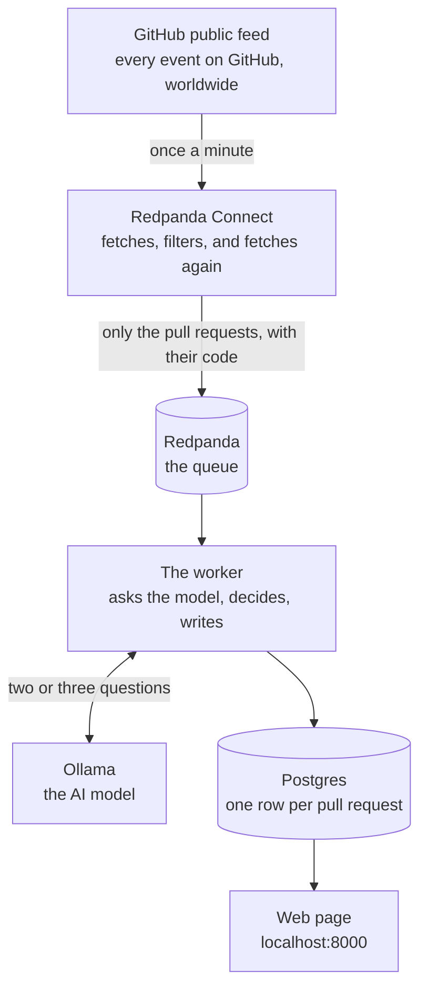

# How this works

This system watches for new pull requests on GitHub, reads the actual code that changed,
and sorts each one into a category (security, feature, refactor, docs or dependency
bump), adding a short risk note that a human can act upon. All of it lands on a web page.

This document walks through every part of it, and for each one it covers what it is, what
it does here, where the code lives, why it's there in the first place and what would make
it better. You don't need to know Kafka or Docker to follow it, as any word that needs
explaining is explained the first time it comes up.

## The picture



Reading it top to bottom, GitHub publishes everything that happens, Connect throws most
of it away and fetches the code for whatever is left, and the queue holds those results
until the worker is ready for them. The worker then asks the model what kind of change it
is and writes the answer down, and the web page shows it. The rest of this document is
one section per box.

---

## 1. GitHub's public feed

**What it is.** GitHub publishes a public list of everything happening on the site right
now, which includes every push, every comment, every star and every pull request on every
public repository. It sits at `https://api.github.com/events`, needs no login, and gives
you roughly 100 items per request.

**What it does here.** It's the only source of data, so nothing else comes in.

**Where the code is.** The address and the polling frequency are at the top of
[connect/ingest.yaml](../connect/ingest.yaml), lines 11 to 30.

**Why it's there.** The exercise needed a public data source, and this one has a property
that ended up shaping the whole design, which is that when a new pull request appears in
the feed GitHub gives you almost nothing about it. Exactly five fields:

```
id, number, url, base, head
```

No title, no description and no code, just a number and a link. Which means a simple rule
can't sort these at all, due to there being nothing to sort on, so the pipeline has to go
and fetch the title and the code before it can do anything useful. That fetching is the
actual job here rather than an extra step on top.

I measured this over 52 pull request events and every single one had exactly those five
keys, and the note is in [NOTES.md](../NOTES.md).

**What would make it better.** Two things.

- GitHub returns a tag with each response called an `ETag`, and if you send it back on
  the next request and nothing has changed, GitHub replies "nothing new" without counting
  it against your hourly limit. The pipeline doesn't do this yet, so every minute costs
  one request whether anything actually happened or not.
- The feed is a moving window of recent events, which means that if the pipeline is down
  for a while, the events from that period are simply gone. For a real deployment I'd use
  GitHub's webhooks, which push each event to you as it happens, rather than polling a
  public list.

---

## 2. Redpanda Connect

**What it is.** A program that moves and reshapes data, and you don't write code for it.
Instead you write a settings file saying get this, throw away that, fetch this extra
thing and send the result over there, and Connect reads the file and does it.

**What it does here.** Everything between GitHub and the queue, in this order:

1. **Asks GitHub for the latest 100 events**, once a minute. That interval isn't a guess,
   as GitHub sends a header telling you the rate it wants.
2. **Throws away everything that isn't a new pull request.** Most of the feed is people
   pushing code, commenting or starring things, so only pull request events with the
   action "opened" survive this step.
3. **Throws away pull requests opened by bots**, as in Dependabot, Renovate or anything
   ending in `[bot]`, because they open enormous numbers of them and there's nothing to
   learn from reading them.
4. **Remembers what it has already seen**, so the same pull request isn't processed again
   when it shows up in the next minute's list. That memory lives in RAM and lasts two
   hours.
5. **Fetches the pull request itself** from GitHub, which is where the title, the
   description, the author and the file count come from.
6. **Fetches the list of changed files**, with the actual code changes in each of them.
7. **Trims it down**, keeping at most 8 files, cutting each file's changes to 1,500
   characters and the description to 2,000, so that one enormous pull request can't end
   up costing a fortune further down the line.
8. **Sends the result to the queue.** If both fetches failed and there's no title and no
   files, it goes to a separate "dead letter" lane instead, so it can be counted and
   looked at later.

Measured over 220 real events, 44 were pull request events, 20 of those were new ones
(the rest being merges and label changes), 2 were bots, and 18 survived. That's roughly
92% thrown away before any fetching or thinking happens at all.

**Where the code is.** All of it sits in [connect/ingest.yaml](../connect/ingest.yaml),
commented step by step. The two fetches are the `branch:` blocks at lines 78 and 101, the
trimming is the big `mapping:` block at line 126, and the routing decision is `output:`
at line 155.

**Why it's there.** Fetching and reshaping is what Connect is genuinely good at, so
that's where it went. Putting it here means the queue holds records that are already
useful to anyone reading them rather than just to this one worker, and it also means the
worker never spends a GitHub request itself.

**What would make it better.**

- **When a fetch fails, nothing notices.** If GitHub times out on the file fetch, the
  record keeps flowing with a title but no code, because the dead-letter check at line
  165 only catches the case where the title *and* the files are both missing. So a pull
  request with a title and no code gets through and the model ends up being asked to
  judge it on the title alone. Connect actually knows the fetch failed, as it sets a
  flag, so the fix is to check that flag instead of checking whether fields happen to be
  empty.
- **The memory of what it has seen dies with the container.** Restart Connect and it
  forgets everything, then re-fetches whatever is still inside GitHub's window, and two
  copies of Connect would each spend the same requests on the same events. The fix here
  is a shared memory such as Redis.
- **The first 8 files aren't necessarily the important 8.** They're whatever order GitHub
  happened to return them in, so a pull request changing nine files, where the ninth is
  the one touching authentication, simply loses that file. The fix is to sort by likely
  risk before cutting, so files with `auth`, `cors`, `secret` or `crypto` in the path go
  first and documentation or lockfiles go last.

---

## 3. Redpanda, the queue

**What it is.** A place to put things so another program can pick them up later, where
items go in one end and come out the other in order, and if the program picking them up
crashes the items are still there when it comes back. Think of a conveyor belt that
doesn't drop anything.

**What it does here.** It sits between Connect and the worker, so Connect puts enriched
pull requests on it and the worker takes them off one at a time.

**Where the code is.** It's a stock image, started in
[docker-compose.yml](../docker-compose.yml) at line 10, and the three lanes are created
by the `topics-init` block at line 38.

**Why it's there.** Connect can fetch pull requests far faster than the model can think
about them, and measured, the model takes roughly 90 seconds per pull request, so a
single worker gets through about 39 an hour. Without a queue in the middle you'd end up
with one of two bad outcomes: either Connect waits for the model and falls behind GitHub,
missing events entirely, or Connect runs ahead and the worker drops whatever it couldn't
keep up with. The queue absorbs that difference, so Connect runs at GitHub's pace, the
worker runs at the model's pace, and neither one blocks the other.

It also means an outage becomes a delay rather than a loss, because if the worker dies
the work simply waits.

**What would make it better.** Right now there's one worker reading the queue, and when
the queue grows faster than it drains the answer is more workers. The lane is set up with
one partition (one ordered stream), so adding workers would mean adding partitions for
each worker to take a share, which is a config change rather than a code change.

---

## 4. The three lanes

Redpanda calls these "topics", and they're named lanes on the queue. There are three:

| Lane | What goes on it | Who reads it |
|---|---|---|
| `pr.enriched` | Pull requests with their code, ready to be judged | The worker |
| `pr.triaged` | Pull requests with their judgement attached | Nothing yet. It exists so something could |
| `pr.dlq` | Things that failed. "Dead letter queue" | Nothing. A human, with `task consume -- pr.dlq` |

**Where the code is.** Created at [docker-compose.yml:48](../docker-compose.yml#L48).
Connect writes to the first and third at [connect/ingest.yaml:155](../connect/ingest.yaml#L155),
and the worker reads the first and writes the second and third, at
[worker.py:55](../worker.py#L55), [107](../worker.py#L107) and [117](../worker.py#L117).

**Why three.** Separating "ready to judge" from "judged" means those judged results are
available to any future system without it needing to re-run the model, and separating
failures into their own lane means you can count them and inspect them without them
clogging up the main path.

**What would make it better.** `pr.triaged` currently has no reader, so the natural next
step is a small program that reads it and sends anything labelled `security` to a Slack
channel or a review queue. The lane is already there precisely so that program is a day's
work rather than a rebuild.

---

## 5. Ollama, the model

**What it is.** The AI. Ollama is a program that runs language models on your own machine
for free and with no account, and the model used here is `qwen2.5:3b`, a small one that
fits on a laptop.

**What it does here.** It answers two questions per pull request. The first one is what
kind of change this is and how sure it is about that, and the second, only if the first
answer came back confident, is which part of the system this touches and what could
break.

**Where the code is.** Both questions are written out in full in
[triage/prompts.py](../triage/prompts.py), the code that sends them is
[triage/llm.py](../triage/llm.py), and the model itself is started in
[docker-compose.yml:123](../docker-compose.yml#L123) and downloaded by the block at line
139.

**Why it's there.** Somebody has to read the code and decide what it is, and a rule
simply can't do that, due to the title saying "bump deps" while the code turns off a
security check. Only reading the change actually tells you, which is a judgement, and the
model is what makes it.

The reason it's a small local model rather than a hosted one is so anyone can run this
with `docker compose up` and no API keys at all, and a hosted model can be switched on
with a single line in `.env`.

**What would make it better.** This is where the biggest weakness lives and it's worth
being blunt about it.

The recorded results in [fixtures/triaged.json](../fixtures/triaged.json) score 9 out of
12, and the three misses are all pull requests written to mislead: a title saying "bump
deps" while the code disables token expiry, "small cleanup" while the code fixes SQL
injection, and "fix typo" while the code opens a security setting to the whole internet.
The model went with the title on all three occasions, at 80 to 90 percent confidence.

Here's the part that really stings. On all three of them the model's *second* answer, the
"what could break" note, correctly named the problem, so the note for "fix typo" says the
change may expose the gateway to any origin while the label sitting above it says
`refactor`. In other words, the model actually saw it, but the loop only uses the first
answer to decide the label, so the second answer's finding went into a text column and
changed absolutely nothing.

The fix isn't a better prompt. It's a rule that runs before the model and can only raise
the alarm, never lower it, so if the path contains `auth`, `cors`, `middleware` or
`secret`, or the code contains `verify_exp: False` or `allowed_origins: "*"`, the label
becomes `security` and the model's job narrows down to explaining why. Rules are good at
floors and models are good at explanations, and this design currently has them the wrong
way round for the one category that matters most.

---

## 6. The worker

**What it is.** A Python program of about 140 lines that reads from the queue, decides
what to do with each pull request and writes the result down. This is the part the
exercise was really about, and it's the one to read if you only read a single file.

**What it does here.** For each pull request, in order:

1. **Checks whether to bother at all.** A draft pull request, or one with no files, or
   one with no readable content, gets written down as "skipped" without asking the model,
   because asking would cost time and return a guess based on the repository name.
2. **Asks the model the first question**, passing the title, description, filenames and
   code changes, and gets back a category plus a confidence score between 0 and 1.
3. **Cleans up the answer**, as small models are messy and will wrap the answer in chat,
   add stray commas, or say "Security Fix" when you asked for "security". Section 7
   covers this in detail.
4. **Decides whether to trust it.** If the model's confidence is below 0.65, or the
   answer couldn't be read at all, it asks again with a stricter version of the question,
   and if that also fails or the model is still unsure it writes "unclear" and records
   why. The worker never guesses.
5. **Asks the second question**, but only when the first answer was trusted, covering
   which part of the system this touches and what could break. This one only sees the
   files the model named as evidence, so it stays short.
6. **Writes the row** to the database, puts a copy on the `pr.triaged` lane, and only
   then tells the queue it's done with this one.

Every row records which of those paths it took, in a column called `label_source`:

| `label_source` | What happened |
|---|---|
| `model` | First answer, trusted. The normal case |
| `model_retry` | First answer was unusable or unsure. The stricter retry worked |
| `fallback` | Both attempts failed. Wrote "unclear" rather than guessing |
| `skipped` | Never asked the model. Draft, or nothing to read |

That column is shown on the web page, so when a row looks wrong it tells you which path
produced it without anyone needing to go and read logs.

**Where the code is.** The loop that reads the queue is [worker.py](../worker.py), and
the decision steps above are [triage/reason.py](../triage/reason.py), which is written to
be read top to bottom and has the three places a change would land marked `SEAM 1`,
`SEAM 2` and `SEAM 3`.


**Why it's built this way.** Three decisions, each one with a reason behind it.

*Two questions instead of one.* The second question, the one about what could break, only
really makes sense if the label is right in the first place, because attaching a
confident-sounding risk note to a wrong label is worse than having no note at all, as
someone will skim the note and believe the label. So the second question only runs once
the first answer has been trusted.

*The worker waits for the model instead of working without it.* An earlier version
consumed pull requests even when the model was down, wrote "unclear" for each of them and
marked them done, which permanently lost them, due to GitHub not sending the same event
twice, so nothing would ever come back to reclassify them. Now the worker checks it can
reach the model before reading anything, and if it can't it waits and says so once a
minute, leaving the pull requests sitting on the queue. See
[worker.py:56](../worker.py#L56).

*It marks a message done only after the database write.* If the worker crashes halfway
through, the message gets delivered again when it restarts, and doing a pull request
twice is perfectly safe because the database write replaces the old row rather than
adding a second one. Losing a pull request is the thing that isn't safe. See
[worker.py:49](../worker.py#L49).

**What would make it better.**

- **A database outage does completely the wrong thing.** If Postgres goes away mid-run,
  every pull request after that fails at the write step, gets sent to the dead-letter
  lane and gets marked done, so when Postgres comes back the worker is left with a dead
  connection and an empty queue. The code currently treats "the database is down" exactly
  the same as "this message is broken", when they need different handling: a broken
  message should be parked, while a down database should make the worker wait and
  reconnect. This is [worker.py:100](../worker.py#L100) to 130.
- **A pull request that got "unclear" because the model was slow never gets another
  chance**, as the row is already marked done. The fix is a small job finding `fallback`
  rows older than a few minutes and putting them back through, though it depends on the
  database fix in section 8 landing first, otherwise a retry during an outage could
  overwrite a good answer with a bad one.
- **The confidence score isn't really doing much.** In practice this model reports 0.85
  or higher on almost everything, including the answers it gets wrong, so the gate at
  0.65 almost never fires and the retry path ends up being triggered by unreadable
  answers rather than by the model saying it's unsure. A better signal would be something
  the model can't inflate, as in whether the files it names as evidence actually exist in
  the diff.

---

## 7. Cleaning up the model's answer

**What it is.** Sixty lines in [triage/parse.py](../triage/parse.py) that turn whatever
the model said into something the code can actually use. This is the riskiest code in the
project, due to it being the one place where free text from an AI becomes structured data
that gets stored.

**What it does here.** Four steps:

1. If the answer is wrapped in a markdown code fence, it takes the inside.
2. It finds the first `{ ... }` block by counting braces while tracking whether it's
   inside a quoted string, because a regular expression can't do this correctly, as a
   brace inside a string value would confuse it.
3. It fixes formatting damage, meaning curly quotes and trailing commas.
4. It checks the category is one of the five allowed ones, lowercasing it, stripping
   spaces and mapping known variations like "dependency bump" to "dependency-bump".

**The rule it follows.** Fix formatting, never fix meaning. A trailing comma is
formatting, whereas turning "banana" into "unclear" would be inventing a judgement the
model never made, so instead the code refuses the answer and the worker asks again.

**Why "unclear" is off-limits to the model.** The model can only choose from the five
real categories, and "unclear" is reserved for the worker to write when it gives up. That
way "unclear" always means the pipeline couldn't decide, and never means the model
shrugged and we quietly accepted it. Combined with the `label_source` column, it makes
every unclear row explainable.

**Where the code is.** All of it in [triage/parse.py](../triage/parse.py), and the tests
are in [tests/test_parse.py](../tests/test_parse.py), covering the shapes a small model
actually produces, as in chatty preambles, fences, braces inside strings, cut-off output,
trailing commas and labels that aren't on the list.

**What would make it better.** Two of the repairs can misfire.

- The trailing-comma fix removes any comma followed by a closing brace, including one
  sitting inside a quoted string, so a rationale like "fixes the list, ]" loses its comma.
  That's a value change, which is the one thing this file promises never to do.
- The curly-quote fix turns `“` into `"` including inside a string, which then ends the
  string early and breaks answers that were perfectly fine to begin with, and the cost of
  that is an unnecessary retry, meaning a whole extra model call.

The fix for both is the same, which is to try reading the answer as-is first and only run
the repairs if that fails, so the repairs only ever touch answers that were already
broken.

One more thing: a confidence of `1.5`, which a model can produce when it half-follows the
"between 0 and 1" instruction, gets treated as a percentage and stored as `0.015`, when
it should be rejected like any other out-of-range number.

---

## 8. Postgres, the database

**What it is.** A database, with one table and one row per pull request.

**What it does here.** It stores the result, and the web page reads from it.

**Where the code is.** The table definition is [db/schema.sql](../db/schema.sql), and the
write is a single statement in [triage/store.py](../triage/store.py) at line 26.

**Why it's built this way.** The write is an "upsert", meaning that if a row for this
pull request already exists it gets replaced, and otherwise it gets inserted. That's
deliberate, due to the same pull request legitimately arriving more than once: GitHub's
feed overlaps from one minute to the next, Connect's memory dies on restart, and a worker
crash replays the message. Every one of those would cause either a crash or a duplicate
if the write were a plain insert.

**What would make it better.** The upsert always lets the newest write win, which is
right when a good answer replaces a bad one, but wrong the other way round, as in when
the model is down and a pull request gets re-run, so "unclear" replaces the correct answer
that was already sitting there. The comment in [store.py:19](../triage/store.py#L19) says
exactly this and says what the fix is, which is a `WHERE` clause on the upsert:

```sql
WHERE EXCLUDED.label_source IN ('model', 'model_retry')
   OR pr_triage.label_source IN ('fallback', 'skipped')
```

Which reads as a real answer being able to replace anything, while a gave-up can only
ever replace another gave-up. That isn't written yet, and it's the first thing I would
add, because the retry job in section 6 is unsafe without it.

---

## 9. The web page

**What it is.** A single page at `localhost:8000` showing the table newest first with a
filter by category, plus a JSON version at `/api/results`.

**Where the code is.** [web.py](../web.py). It's one file, the HTML is built as a string
inside it, and there's no template engine and no JavaScript framework.

**Why it's that simple.** The exercise asked for somewhere we can see it, and a plain
table you can read in one sitting beats a dashboard that needs a build step.

**What would make it better.** There's no login at all, so anyone who can reach port 8000
sees everything, and each page load opens its own database connection and closes it
again. Both are fine on one laptop and not fine anywhere else.

---

## 10. The seed

**What it is.** A small program that runs once at startup and puts twelve
already-classified pull requests into the database.

**Where the code is.** [scripts/seed_offline.py](../scripts/seed_offline.py), started by
the `seed` block in [docker-compose.yml:184](../docker-compose.yml#L184), and the twelve
rows live in [fixtures/triaged.json](../fixtures/triaged.json).

**Why it's there.** New pull requests are roughly 2 in every 100 events and the model
takes 90 seconds each, so without this `docker compose up` would show an empty table for
several minutes, whereas with it the page has rows the moment it opens. They're a
recording of a real earlier run rather than anything invented, and every row's `model`
column says so.

**What would make it better.** The twelve fixtures were written by hand to make a point
and the labels were written by the same hand, which is fine for a demo and not a real
test. The next version should use real pull requests captured off the queue and labelled
after the fact, and should report how many real security changes it misses, because
that's the number that actually matters here.

---

## 11. Docker Compose, the on switch

**What it is.** One file that starts every part above in the right order.

**Where the code is.** [docker-compose.yml](../docker-compose.yml), where each block is
one part and each has a `depends_on` saying what has to be running or finished first.

**Why the order matters.** The worker must not start before the queue has its lanes,
before the database is accepting connections, or before the model has been downloaded,
and the file encodes all of that. A reviewer runs one command and everything comes up in
sequence, verified from an empty machine at roughly two and a half minutes.

**One thing to know.** The model download is allowed to fail, so if it times out the
block prints a warning and reports success anyway, letting the rest of the stack start.
Which means the "worker waits for model download" dependency doesn't actually guarantee a
model exists. What guarantees it is the worker's own check in section 6, where it asks
the model a test question and waits until it gets an answer back. The compose file
handles the order, while the worker handles the truth.

---

## One pull request, start to finish

Taking a real one from the recorded data, `acme/gateway` pull request 56, titled
"fix typo":

1. It appears in GitHub's feed as a pull request event with five fields.
2. Connect keeps it, as it's a pull request, it was opened, and the author isn't a bot.
3. Connect fetches the title ("fix typo") and the description.
4. Connect fetches the files, and there's one, `config/cors.yaml`, where the change sets
   `allowed_origins` to `"*"` and turns on `allow_credentials`.
5. Connect trims it, though there's nothing to trim as it's small, and puts it on
   `pr.enriched`.
6. The worker picks it up. Not a draft, has a file, has content, so it proceeds.
7. The worker asks the model question one, and the model says `refactor` at 0.80
   confidence, with "Modifies configuration file without changing security or adding new
   features."
8. 0.80 is above 0.65, so it's trusted, and the worker asks question two showing only
   `config/cors.yaml`.
9. The model replies with affected area `security` and a note saying that introducing `*`
   may expose the gateway to unauthorized access from any origin.
10. The worker writes the row with category `refactor`, a note warning about security and
    source `model`, then marks the message done.

So the row on the web page says `refactor` while the note sitting next to it describes a
security problem. The model saw it, and the design simply didn't use what it saw. That's
the gap described in section 5, and it's the first thing worth fixing after the database
guard.

---

## What I would do next, in order

1. **The database guard** (section 8), because a worse answer must not be able to replace
   a better one, and nothing that re-runs a pull request is safe until this exists.
2. **The retry job for "unclear" rows** (section 6), which with the guard in place is a
   query and a loop, and turns a model outage from data loss into a delay.
3. **The security floor** (section 5), a rule that can only raise the alarm, running
   before the model, and the only change that actually fixes the three confident misses.
4. **Check the failure flag in Connect** (section 2), because until then a pull request
   with a title and no code can still reach the model.
5. **A real evaluation set** (section 10), using captured pull requests labelled
   afterwards and reporting how many security changes were missed.

The order is dependency. One and two are a pair, three changes what the worker does and
should be measured by five, and four is small and independent of everything else.
