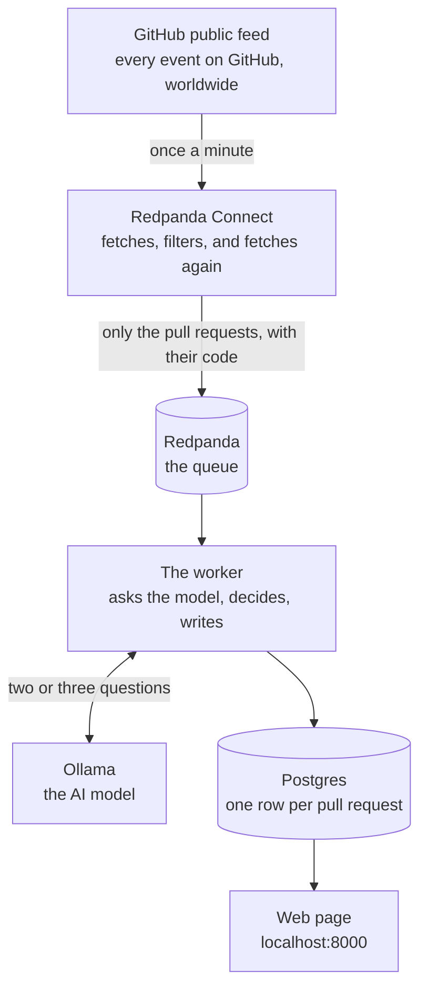

# How this works

This system watches for new pull requests on GitHub, reads the actual code that changed,
and sorts each one into a category: security, feature, refactor, docs, or dependency
bump. It writes a short note about what could break. The results show up on a web page.

This document walks through every part of it. For each part: what it is, what it does
here, where the code lives, why it is there, and what would make it better. You do not
need to know Kafka or Docker to follow it. Words that need explaining are explained the
first time they come up.

## The picture



Read it top to bottom. GitHub publishes everything that happens. Connect throws most of
it away and fetches the code for what is left. The queue holds the results until the
worker is ready. The worker asks the model what kind of change it is, and writes the
answer down. The web page shows the answers.

The rest of this document is one section per box.

---

## 1. GitHub's public feed

**What it is.** GitHub publishes a public list of everything happening on the site right
now. Every push, every comment, every star, every pull request, on every public
repository. It is at `https://api.github.com/events` and needs no login. You get about
100 items per request.

**What it does here.** It is the only source of data. Nothing else comes in.

**Where the code is.** The address and how often we ask are at the top of
[connect/ingest.yaml](../connect/ingest.yaml), lines 11 to 30.

**Why it is there.** The exercise needed a public data source. This one has a property
that made the whole design: when a new pull request appears in the feed, GitHub gives
you almost nothing about it. Five fields:

```
id, number, url, base, head
```

No title. No description. No code. Just a number and a link. That means a simple rule
cannot sort these, because there is nothing to sort on. The pipeline has to go and fetch
the title and the code before it can do anything. That fetching is the whole job, not an
extra.

I measured this over 52 pull request events and every one had exactly those five keys.
The note is in [NOTES.md](../NOTES.md).

**What would make it better.** Two things.

- GitHub gives you a tag with each response called an `ETag`. If you send it back next
  time and nothing has changed, GitHub replies "nothing new" and does not count it
  against your hourly limit. The pipeline does not do this yet, so every minute costs one
  request whether anything happened or not.
- The feed is a moving window of recent events. If the pipeline is down for a while, the
  events from that time are gone. For a real deployment you would use GitHub's webhooks,
  which push each event to you as it happens, instead of polling a public list.

---

## 2. Redpanda Connect

**What it is.** A program that moves and reshapes data. You do not write code for it.
You write a settings file that says: get this, throw away that, fetch this extra thing,
send the result there. Connect reads the file and does it.

**What it does here.** Everything between GitHub and the queue. In order:

1. **Asks GitHub for the latest 100 events**, once a minute. Once a minute is not a
   guess; GitHub sends a header saying that is the rate it wants.
2. **Throws away everything that is not a new pull request.** Most of the feed is
   people pushing code, commenting, or starring things. Only pull request events with
   the action "opened" survive.
3. **Throws away pull requests opened by bots.** Dependabot, Renovate, anything ending
   in `[bot]`. They open enormous numbers and there is nothing to learn from reading
   them.
4. **Remembers what it has already seen**, so the same pull request is not processed
   again when it shows up in the next minute's list. This memory is in RAM and lasts two
   hours.
5. **Fetches the pull request itself** from GitHub: the title, the description, who
   wrote it, how many files changed.
6. **Fetches the list of changed files**, with the actual code changes in each.
7. **Trims it down.** Keeps at most 8 files. Cuts each file's changes to 1,500
   characters. Cuts the description to 2,000. This is so one enormous pull request
   cannot cost a fortune later.
8. **Sends the result to the queue.** If both fetches failed and there is no title and
   no files, it goes to a separate "dead letter" lane instead, so it can be counted and
   looked at.

Measured over 220 real events: 44 were pull request events, 20 of those were new ones
(the rest were merges and label changes), 2 were bots, 18 survived. That is 92% thrown
away before any fetching or thinking happens.

**Where the code is.** All of it is in [connect/ingest.yaml](../connect/ingest.yaml).
The file is commented step by step. The two fetches are the `branch:` blocks at lines
78 and 101. The trimming is the big `mapping:` block at line 126. The routing decision
is `output:` at line 155.

**Why it is there.** Fetching and reshaping is what Connect is good at, so that is
where it went. Putting it here means the queue holds records that are already useful to
anyone who reads them, not just to this one worker. It also means the worker never
spends a GitHub request itself.

**What would make it better.**

- **When a fetch fails, nothing notices.** If GitHub times out on the file fetch, the
  record keeps going with a title but no code. The dead-letter check at line 165 only
  catches the case where the title *and* the files are both missing. A pull request with
  a title and no code gets through and the model is asked to judge it on the title
  alone. Connect actually knows the fetch failed; it sets a flag. The fix is to check
  that flag instead of checking whether fields happen to be empty.
- **The memory of what it has seen dies with the container.** Restart Connect and it
  forgets, then re-fetches everything still in GitHub's window. Two copies of Connect
  would each spend the same requests on the same events. The fix is a shared memory
  such as Redis.
- **The first 8 files are not necessarily the important 8.** They are whatever order
  GitHub returned them in. A pull request that changes nine files, where the ninth is
  the one that touches authentication, loses that file. The fix is to sort by likely
  risk before cutting: files with `auth`, `cors`, `secret` or `crypto` in the path go
  first, documentation and lockfiles go last.

---

## 3. Redpanda, the queue

**What it is.** A place to put things so another program can pick them up later. Items
go in one end, come out the other, in order. If the program picking them up crashes,
the items are still there when it comes back. Think of a conveyor belt that does not
drop anything.

**What it does here.** It sits between Connect and the worker. Connect puts enriched
pull requests on it. The worker takes them off, one at a time.

**Where the code is.** It is a stock image, started in
[docker-compose.yml](../docker-compose.yml) at line 10. The three lanes are created by
the `topics-init` block at line 38.

**Why it is there.** Connect can fetch pull requests much faster than the model can
think about them. Measured, the model takes about 90 seconds per pull request, so one
worker gets through roughly 39 an hour. Without a queue in the middle, either Connect
would have to wait for the model (and fall behind GitHub, missing events), or Connect
would run ahead and the worker would drop what it could not keep up with. The queue
absorbs the difference. Connect runs at GitHub's pace, the worker runs at the model's
pace, and neither blocks the other.

It also means an outage is a delay, not a loss. If the worker dies, the work waits.

**What would make it better.** Right now there is one worker reading the queue. When
the queue grows faster than it drains, the answer is more workers. The lane is set up
with one partition (one ordered stream), and adding workers would mean adding partitions
so each worker takes a share. That is a config change, not a code change.

---

## 4. The three lanes

Redpanda calls these "topics". They are named lanes on the queue. There are three:

| Lane | What goes on it | Who reads it |
|---|---|---|
| `pr.enriched` | Pull requests with their code, ready to be judged | The worker |
| `pr.triaged` | Pull requests with their judgement attached | Nothing yet. It exists so something could |
| `pr.dlq` | Things that failed. "Dead letter queue" | Nothing. A human, with `task consume -- pr.dlq` |

**Where the code is.** Created at [docker-compose.yml:48](../docker-compose.yml#L48).
Connect writes to the first and third at [connect/ingest.yaml:155](../connect/ingest.yaml#L155).
The worker reads the first and writes the second and third, at
[worker.py:55](../worker.py#L55), [107](../worker.py#L107) and [117](../worker.py#L117).

**Why three.** Separating "ready to judge" from "judged" means the judged results are
available to any future system without it having to re-run the model. Separating
failures into their own lane means you can count them and look at them without them
clogging the main path.

**What would make it better.** `pr.triaged` has no reader. The natural next step is a
small program that reads it and sends anything labelled `security` to a Slack channel
or a review queue. The lane is there so that program is a day's work, not a rebuild.

---

## 5. Ollama, the model

**What it is.** The AI. Ollama is a program that runs language models on your own
machine, for free, with no account. The model used here is `qwen2.5:3b`, a small one
that fits on a laptop.

**What it does here.** Answers two questions per pull request. First: "what kind of
change is this, and how sure are you?" Second, if the first answer was confident: "which
part of the system does this touch, and what could break?"

**Where the code is.** The two questions are written out in full in
[triage/prompts.py](../triage/prompts.py). The code that sends them is
[triage/llm.py](../triage/llm.py). The model itself is started in
[docker-compose.yml:123](../docker-compose.yml#L123) and downloaded by the block at
line 139.

**Why it is there.** Somebody has to read the code and decide what it is. A rule cannot
do that: the title says "bump deps" and the code turns off a security check. Only
reading the change tells you. That is a judgement, and the model makes it.

The reason it is a small local model rather than a hosted one is so anyone can run
this with `docker compose up` and no API keys. A hosted model can be switched on with
one line in `.env`.

**What would make it better.** This is where the biggest weakness lives, and it is
worth being blunt about.

The recorded results in [fixtures/triaged.json](../fixtures/triaged.json) score 9 out
of 12. The three misses are all pull requests written to mislead: a title that says
"bump deps" while the code disables token expiry, "small cleanup" while the code fixes
SQL injection, "fix typo" while the code opens a security setting to the whole
internet. The model went with the title all three times, at 80 to 90 percent
confidence.

Here is the part that stings. On all three, the model's *second* answer, the "what
could break" note, correctly named the problem. The note for "fix typo" says the
change may expose the gateway to any origin. The label above it says `refactor`. The
model saw it. The loop only uses the first answer to decide the label, so the second
answer's finding went into a text column and changed nothing.

The fix is not a better prompt. It is a rule that runs before the model and can only
raise the alarm, never lower it: if the path contains `auth`, `cors`, `middleware`,
`secret`, or the code contains `verify_exp: False` or `allowed_origins: "*"`, the
label is `security` and the model's job becomes explaining why. Rules are good at
floors. Models are good at explanations. This design has them the wrong way round for
the one category that matters most.

---

## 6. The worker

**What it is.** A Python program. About 140 lines. It reads from the queue, decides
what to do with each pull request, and writes the result down. This is the part the
exercise was about, and it is the part to read if you read only one file.

**What it does here.** For each pull request, in order:

1. **Checks whether to bother.** A draft pull request, or one with no files, or one
   with no readable content, is written down as "skipped" without asking the model.
   Asking the model would cost time and get a guess based on the repository name.
2. **Asks the model the first question.** Title, description, filenames, code changes.
   Gets back a category and a confidence score between 0 and 1.
3. **Cleans up the answer.** Small models are messy. They wrap the answer in chat, add
   stray commas, and say "Security Fix" when you asked for "security". Section 7 covers
   this.
4. **Decides whether to trust it.** If the model's confidence is below 0.65, or the
   answer could not be read at all, ask again with a stricter version of the question.
   If that also fails, or the model is still unsure, write "unclear" and record why. The
   worker never guesses.
5. **Asks the second question**, only when the first answer was trusted. "Which part
   of the system, and what could break?" This one only sees the files the model named as
   evidence, so it is short.
6. **Writes the row** to the database, puts a copy on the `pr.triaged` lane, and only
   then tells the queue "done with this one".

Every row records which of those paths it took, in a column called `label_source`:

| `label_source` | What happened |
|---|---|
| `model` | First answer, trusted. The normal case |
| `model_retry` | First answer was unusable or unsure. The stricter retry worked |
| `fallback` | Both attempts failed. Wrote "unclear" rather than guessing |
| `skipped` | Never asked the model. Draft, or nothing to read |

That column is shown on the web page. When a row looks wrong, it tells you which path
produced it without having to read logs.

**Where the code is.** The loop that reads the queue is [worker.py](../worker.py). The
decision steps above are [triage/reason.py](../triage/reason.py), which is written to
be read top to bottom and has the three places a change would land marked `SEAM 1`,
`SEAM 2` and `SEAM 3`.


**Why it is built this way.** Three decisions, each with a reason.

*Two questions instead of one.* The second question, "what could break", only makes
sense if the label is right. Attaching a confident-sounding risk note to a wrong label
is worse than no note, because someone will skim the note and believe the label. So
the second question only runs after the first answer has been trusted.

*The worker waits for the model instead of working without it.* An earlier version
consumed pull requests even when the model was down, wrote "unclear" for each, and
marked them done. That permanently lost them: GitHub does not send the same event
twice, so nothing would ever come back to reclassify them. Now the worker checks it can
reach the model before it reads anything, and if it cannot, it waits and says so once a
minute. The pull requests stay on the queue. See [worker.py:56](../worker.py#L56).

*It marks a message done only after the database write.* If the worker crashes in the
middle, the message is delivered again when it restarts. Doing a pull request twice is
safe, because the database write replaces the old row rather than adding a second one.
Losing a pull request is not safe. See [worker.py:49](../worker.py#L49).

**What would make it better.**

- **A database outage does the wrong thing.** If Postgres goes away mid-run, every
  pull request after that fails at the write step, gets sent to the dead-letter lane,
  and gets marked done. When Postgres comes back the worker still has a dead connection
  and the queue is empty. The code treats "the database is down" the same as "this
  message is broken", and they need different handling: a broken message should be
  parked, a down database should make the worker wait and reconnect. This is
  [worker.py:100](../worker.py#L100) to 130.
- **A pull request that got "unclear" because the model was slow never gets another
  chance.** The row is marked done. The fix is a small job that finds `fallback` rows
  older than a few minutes and puts them back through. It depends on the database fix
  in section 8 landing first, otherwise a retry during an outage could overwrite a
  good answer with a bad one.
- **The confidence score is not doing much.** In practice this model reports 0.85 or
  higher on almost everything, including the answers it gets wrong. The gate at 0.65
  almost never fires. The retry path is triggered by unreadable answers, not by the
  model saying it is unsure. A better signal would be something the model cannot
  inflate, such as whether the files it names as evidence actually exist in the diff.

---

## 7. Cleaning up the model's answer

**What it is.** Sixty lines in [triage/parse.py](../triage/parse.py) that turn whatever
the model said into something the code can use. This is the riskiest code in the
project, because it is the one place where free text from an AI becomes structured
data that gets stored.

**What it does here.** Four steps:

1. If the answer is wrapped in a markdown code fence, take the inside.
2. Find the first `{ ... }` block by counting braces, tracking whether it is inside a
   quoted string. A regular expression cannot do this correctly; a brace inside a string
   value would confuse it.
3. Fix formatting damage: curly quotes, trailing commas.
4. Check the category is one of the five allowed. Lowercase it, strip spaces, map known
   variations like "dependency bump" to "dependency-bump".

**The rule it follows.** Fix formatting. Never fix meaning. A trailing comma is
formatting. Turning "banana" into "unclear" would be inventing a judgement the model
never made, so instead the code refuses the answer and the worker asks again.

**Why "unclear" is off-limits to the model.** The model can only choose from the five
real categories. "Unclear" is reserved for the worker to write when it gives up. That
way, "unclear" always means "the pipeline could not decide", never "the model shrugged
and we accepted it". Combined with the `label_source` column, every unclear row is
explainable.

**Where the code is.** All in [triage/parse.py](../triage/parse.py). The tests for it
are in [tests/test_parse.py](../tests/test_parse.py) and cover the shapes a small model
actually produces: chatty preambles, fences, braces inside strings, cut-off output,
trailing commas, and labels that are not on the list.

**What would make it better.** Two of the repairs can misfire.

- The trailing-comma fix removes any comma followed by a closing brace, including one
  inside a quoted string. So a rationale like "fixes the list, ]" loses its comma. That
  is a value change, which is the one thing this file promises not to do.
- The curly-quote fix turns `“` into `"`, including inside a string, which then ends the
  string early and breaks answers that were fine. The cost is an unnecessary retry, a
  whole extra model call.

The fix for both is the same: try to read the answer as-is first, and only run the
repairs if that fails. Then the repairs only ever touch answers that were already
broken.

One more: a confidence of `1.5`, which a model can produce when it half-follows the
"between 0 and 1" instruction, gets treated as a percentage and stored as `0.015`.
It should be rejected like any other out-of-range number.

---

## 8. Postgres, the database

**What it is.** A database. One table, one row per pull request.

**What it does here.** Stores the result. The web page reads from it.

**Where the code is.** The table definition is [db/schema.sql](../db/schema.sql). The
write is one statement in [triage/store.py](../triage/store.py) at line 26.

**Why it is built this way.** The write is an "upsert": if a row for this pull request
already exists, replace it; otherwise insert it. That is deliberate, because the same
pull request legitimately arrives more than once. GitHub's feed overlaps from one
minute to the next. Connect's memory dies on restart. A worker crash replays the
message. Every one of those would cause a crash or a duplicate if the write were a
plain insert.

**What would make it better.** The upsert always lets the newest write win. That is
right when a good answer replaces a bad one. It is wrong the other way round: if the
model is down and a pull request is re-run, "unclear" replaces the correct answer that
was already there. The comment in [store.py:19](../triage/store.py#L19) says this and
says what the fix is. It is a `WHERE` clause on the upsert:

```sql
WHERE EXCLUDED.label_source IN ('model', 'model_retry')
   OR pr_triage.label_source IN ('fallback', 'skipped')
```

Which reads: a real answer can replace anything, a gave-up can only replace another
gave-up. That is not written yet. It is the first thing I would add, because the retry
job in section 6 is unsafe without it.

---

## 9. The web page

**What it is.** A single page at `localhost:8000` showing the table, newest first, with
a filter by category. Also a JSON version at `/api/results`.

**Where the code is.** [web.py](../web.py). It is one file, the HTML is built as a
string inside it, there is no template engine and no JavaScript framework.

**Why it is that simple.** The exercise asked for "somewhere we can see it". A plain
table you can read in one sitting beats a dashboard that needs a build step.

**What would make it better.** There is no login. Anyone who can reach port 8000 sees
everything. And each page load opens its own database connection and closes it. Both
are fine on one laptop and not fine anywhere else.

---

## 10. The seed

**What it is.** A small program that runs once at startup and puts twelve
already-classified pull requests into the database.

**Where the code is.** [scripts/seed_offline.py](../scripts/seed_offline.py), started
by the `seed` block in [docker-compose.yml:184](../docker-compose.yml#L184). The twelve
rows are in [fixtures/triaged.json](../fixtures/triaged.json).

**Why it is there.** New pull requests are about 2 in every 100 events, and the model
takes 90 seconds each. Without this, `docker compose up` would show an empty table for
several minutes. With it, the page has rows the moment it opens. They are a recording
of a real earlier run, not invented, and every row's `model` column says so.

**What would make it better.** The twelve fixtures were written by hand to make a
point, and the labels were written by the same hand. That is fine for a demo and not a
real test. The next version should use real pull requests captured off the queue and
labelled after the fact, and should report how many real security changes it misses,
because that is the number that matters.

---

## 11. Docker Compose, the on switch

**What it is.** One file that starts every part above in the right order.

**Where the code is.** [docker-compose.yml](../docker-compose.yml). Each block is one
part. Each has a `depends_on` saying what has to be running or finished first.

**Why the order matters.** The worker must not start before the queue has its lanes,
before the database is accepting connections, or before the model is downloaded. The
file encodes that. A reviewer runs one command and everything comes up in sequence,
verified from an empty machine at about two and a half minutes.

**One thing to know.** The model download is allowed to fail. If the download times
out, the block prints a warning and reports success anyway, so the rest of the stack
still starts. That means the "worker waits for model download" dependency does not
actually guarantee a model exists. What guarantees it is the worker's own check in
section 6: it asks the model a test question and waits until it gets an answer. The
compose file handles the order; the worker handles the truth.

---

## One pull request, start to finish

Take a real one from the recorded data: `acme/gateway` pull request 56, titled
"fix typo".

1. It appears in GitHub's feed as a pull request event with five fields.
2. Connect keeps it: it is a pull request, it was opened, the author is not a bot.
3. Connect fetches the title ("fix typo") and description.
4. Connect fetches the files. There is one: `config/cors.yaml`. The change sets
   `allowed_origins` to `"*"` and turns on `allow_credentials`.
5. Connect trims it (nothing to trim, it is small) and puts it on `pr.enriched`.
6. The worker takes it. Not a draft, has a file, has content. Proceed.
7. The worker asks the model question one. The model says `refactor`, 0.80 confident.
   "Modifies configuration file without changing security or adding new features."
8. 0.80 is above 0.65. Trusted. The worker asks question two, showing only
   `config/cors.yaml`.
9. The model says: affected area `security`, and a note that introducing `*` may expose
   the gateway to unauthorized access from any origin.
10. The worker writes the row: category `refactor`, note warns about security, source
    `model`. Marks the message done.

The row on the web page says `refactor`. The note next to it describes a security
problem. The model saw it. The design did not use what it saw. That is the gap
described in section 5, and it is the first thing worth fixing after the database
guard.

---

## What I would do next, in order

1. **The database guard** (section 8). A worse answer must not be able to replace a
   better one. Nothing that re-runs a pull request is safe until this exists.
2. **The retry job for "unclear" rows** (section 6). With the guard in place it is a
   query and a loop, and it turns a model outage from data loss into delay.
3. **The security floor** (section 5). A rule that can only raise the alarm, run
   before the model. It is the only change that fixes the three confident misses.
4. **Check the failure flag in Connect** (section 2). Until then a pull request with a
   title and no code can still reach the model.
5. **A real evaluation set** (section 10). Captured pull requests, labelled afterwards,
   reporting how many security changes were missed.

The order is dependency. One and two are a pair. Three changes what the worker does and
should be measured by five. Four is small and independent.
