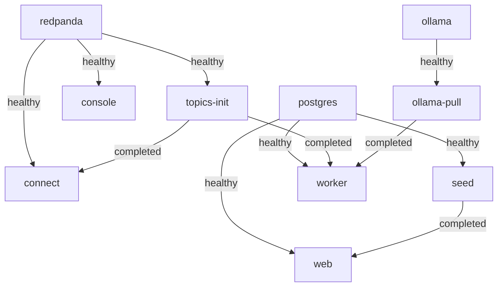
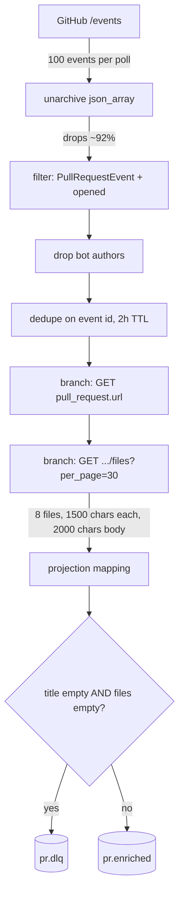
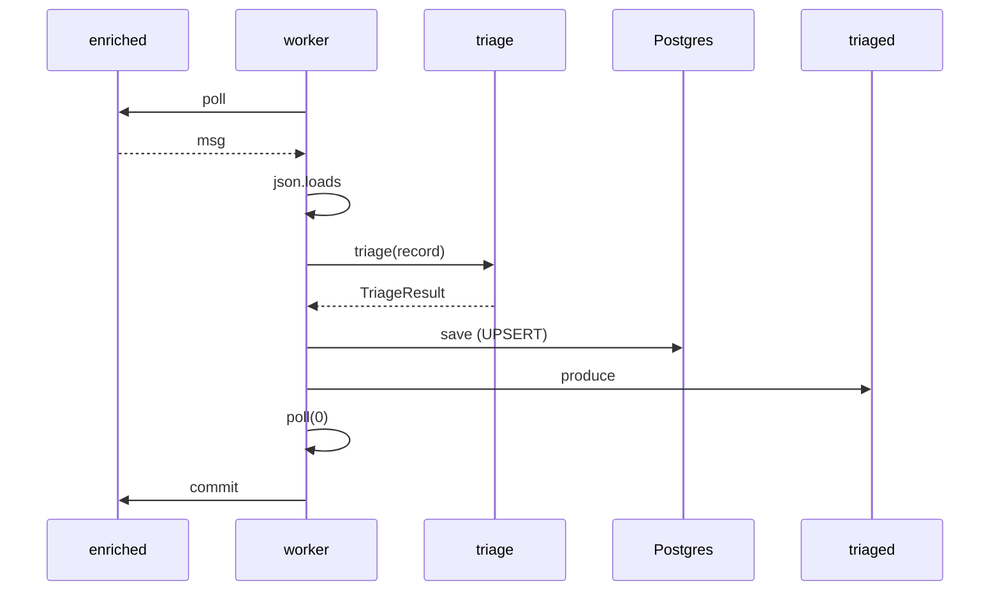
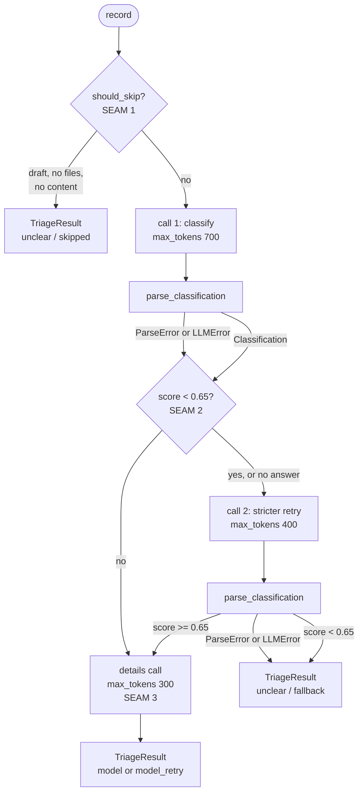

# Architecture

How the pipeline is put together, why it is put together that way, and what is wrong
with it. Written after submission, on a re-read of the code. Every claim below points at
a file and a line. Where the code and the docs disagreed, the code wins and the drift is
listed in section 8.

## 1. Purpose and constraint

The pipeline watches new pull requests on the GitHub public events feed, fetches the code
that changed, asks a language model what kind of change it is, and writes one row per
pull request to Postgres. A web page shows the rows. That is the whole thing.

One fact drove the design. GitHub's `/events` feed describes a new pull request with
five keys: `id`, `number`, `url`, `base`, `head`. No title, no body, no diff. The
observation is recorded in [NOTES.md](../NOTES.md) under "Picking the source", and the
Connect config restates it at [connect/ingest.yaml:76](../connect/ingest.yaml#L76). A
rule cannot classify a change it cannot see, so the pipeline has to go and get the
title and the patches before any judgement is possible. Enrichment is not an
optimisation on top of the feed. It is the only way the feed becomes usable.

That fact put the enrichment in Redpanda Connect rather than in the worker, because it
is fetching and reshaping, which is what Connect is for. It also put a filter in front of
the enrichment, because most of the feed is not a pull request at all: measured over
220 events, 18 survive ([connect/ingest.yaml:42-45](../connect/ingest.yaml#L42)). And
it put a hard bound on how much of each patch reaches the model, because a single large
pull request must not be able to blow up a model call downstream.

The worker does the judgement. It is one Python process with one loop and no threads
([worker.py:3-5](../worker.py#L3)). The reasoning is in
[triage/reason.py](../triage/reason.py) and is meant to be read top to bottom.

## 2. Runtime topology



Edges are the `depends_on` entries in [docker-compose.yml](../docker-compose.yml). The
label on each edge is the compose condition.

| Service | Image | Role | Ports | Waits for | Lifetime |
|---|---|---|---|---|---|
| `redpanda` | `redpandadata/redpanda` | Broker, single node, dev-container mode | 19092, 9644 | nothing | long-running |
| `topics-init` | `redpandadata/redpanda` | Creates `pr.enriched`, `pr.triaged`, `pr.dlq` | none | redpanda healthy | one-shot |
| `console` | `redpandadata/console` | Topic browser | 8080 | redpanda healthy | long-running |
| `postgres` | `postgres:16` | Stores one row per PR; runs `schema.sql` on an empty volume | 55432 | nothing | long-running |
| `connect` | `redpandadata/connect` | Poll, filter, dedupe, enrich, project, route | none | redpanda healthy, topics-init completed | long-running |
| `ollama` | `ollama/ollama` | Local model server | 11434 | nothing | long-running |
| `ollama-pull` | `ollama/ollama` | Downloads `qwen2.5:3b` | none | ollama healthy | one-shot |
| `seed` | built from `Dockerfile` | Loads recorded rows so the UI is not empty | none | postgres healthy | one-shot |
| `worker` | built from `Dockerfile` | Consumes `pr.enriched`, reasons, writes | none | postgres healthy, topics-init completed, ollama-pull completed | long-running |
| `web` | built from `Dockerfile` | Serves the table and `/api/results` | 8000 | postgres healthy, seed completed | long-running |

Two things about this graph are not obvious from the diagram.

`ollama-pull` always exits 0. The loop at
[docker-compose.yml:159-175](../docker-compose.yml#L159) tries three times and then
prints a banner and exits 0 anyway, so that a blocked model download does not stop the
rest of the stack. That means the `ollama-pull → worker` edge is satisfied whether or not
a model exists. The worker's real guard is the availability probe at
[worker.py:68](../worker.py#L68), which calls
[LLMClient.available()](../triage/llm.py#L30) every five seconds and does not subscribe
until it returns true. The compose dependency orders startup; the probe is what
protects the data.

`seed` runs `seed_offline.py` without `--force`, so it inserts with
`ON CONFLICT DO NOTHING` ([scripts/seed_offline.py](../scripts/seed_offline.py)). A
restart never overwrites a live classification with a recorded one. `task seed:offline`
passes `--force` and does overwrite, on purpose, because the reason to run it by hand is
that `task demo:fallback` replaced the recorded rows.

## 3. Data flow, end to end



Each node is one processor in [connect/ingest.yaml](../connect/ingest.yaml), in the order
it runs. The numbers on the edges are read from the config, not estimated.

| Step | Where | What it does to the record |
|---|---|---|
| Poll | [:11-30](../connect/ingest.yaml#L11) | One request per minute under the `github_poll` limiter, `per_page=100`, `retries: 3`, `timeout: 20s` |
| Filter | [:50-52](../connect/ingest.yaml#L50) | Keeps `PullRequestEvent` with `action == "opened"`. Measured: 92% of the feed is dropped here and at the next step |
| Bots | [:57-62](../connect/ingest.yaml#L57) | Drops `[bot]`, `dependabot`, `renovate`, `github-actions` |
| Dedupe | [:71-73](../connect/ingest.yaml#L71) | Keyed on event `id`, in-memory cache, 2h TTL ([:180-183](../connect/ingest.yaml#L180)) |
| Enrich 1 | [:78-96](../connect/ingest.yaml#L78) | Fetches the PR object into `root.pr`. `github_api` limiter, 900/hr, `retries: 3`, `timeout: 15s` |
| Enrich 2 | [:101-117](../connect/ingest.yaml#L101) | Fetches `files?per_page=30` into `root.changed_files`. Same limiter and retries |
| Project | [:126-153](../connect/ingest.yaml#L126) | Keeps the first 8 files (`slice(0, 8)`), truncates each `patch` to 1500 characters and `body` to 2000. One mapping, on purpose: a second one would rebuild `root` and drop everything |
| Route | [:155-178](../connect/ingest.yaml#L155) | If `files` is empty and `title` is empty, `pr.dlq`. Otherwise `pr.enriched`, keyed on `pr_url` |

The two rate limiters are separate on purpose. `github_poll` is one call per 60 seconds,
which is GitHub's documented `X-Poll-Interval`. `github_api` is 900 per hour and is shared
by both enrichment fetches. The comment at
[connect/ingest.yaml:22-26](../connect/ingest.yaml#L22) says why: with one limiter, a
burst of surviving PRs could delay the next poll, and the next poll could starve the
enrichment.

### One message through the worker



This is [worker.py:81-130](../worker.py#L81). The commit is the last line of the loop
body, after the Postgres write and after the produce call. Auto-commit is off
([worker.py:53](../worker.py#L53)). If the process dies anywhere before line 130 the
message is redelivered on restart. That is the intended behaviour and the reason the
Postgres write is an UPSERT; see section 6.

If `json.loads` fails the message goes to `pr.dlq` with a `reason` header and is
committed ([worker.py:91-98](../worker.py#L91)). Anything else that escapes `triage()`
is caught by the catch-all at [worker.py:115](../worker.py#L115), sent to `pr.dlq`, and
also committed. Section 8.2 explains why that second case is a problem.

## 4. The reasoning loop



This is [triage/reason.py:108-191](../triage/reason.py#L108), drawn as it branches. The
three seams are marked in the source with the same names.

- **SEAM 1** is `should_skip` at [:35-51](../triage/reason.py#L35). It runs before any
  model call and returns a reason string or `None`.
- **SEAM 2** is the gate at [:144](../triage/reason.py#L144):
  `needs_retry = classification is None or classification.confidence.score < threshold`.
  An unparseable first answer and a low-confidence first answer take the same branch.
- **SEAM 3** is the details call at [:177-178](../triage/reason.py#L177). It only runs
  once a classification has been accepted, and its result never changes the label.

The threshold is `DEFAULT_THRESHOLD = 0.65` at [:27](../triage/reason.py#L27),
overridable by `CONFIDENCE_THRESHOLD`. The per-call token budgets are 700 for the first
classify (the default at [triage/llm.py:27](../triage/llm.py#L27)), 400 for the retry
([:153](../triage/reason.py#L153)), and 300 for details
([:93](../triage/reason.py#L93)). The availability probe uses 5
([triage/llm.py:39](../triage/llm.py#L39)).

`llm_calls` counts calls made, not calls that parsed. The details call is counted at
[:177](../triage/reason.py#L177) before it runs, so a happy-path row shows 2 and a
retried row shows 3.

| `label_source` | Set at | Meaning |
|---|---|---|
| `model` | [:172](../triage/reason.py#L172) | First answer parsed and scored at or above the threshold |
| `model_retry` | [:170](../triage/reason.py#L170) | First answer was unusable or under the threshold; the stricter retry parsed and scored at or above it |
| `fallback` | [:158](../triage/reason.py#L158), [:163](../triage/reason.py#L163) | The retry also failed, or scored under the threshold a second time. Category forced to `unclear`, confidence to 0, reason in `rationale` |
| `skipped` | [:125](../triage/reason.py#L125) | `should_skip` returned a reason. No model call was made |

Four things are true of every row, by construction:

1. **Every record produces a row.** Every path out of `triage()` returns a
   `TriageResult` ([:125](../triage/reason.py#L125), [:158](../triage/reason.py#L158),
   [:163](../triage/reason.py#L163), [:180](../triage/reason.py#L180)). Exceptions from
   the model or the parser are caught inside the function.
2. **`unclear` is never a model choice.** `MODEL_CATEGORIES` at
   [triage/contract.py:82](../triage/contract.py#L82) excludes it, and
   `normalize_category` at [triage/parse.py:157](../triage/parse.py#L157) returns `None`
   for anything not in that set, which raises `ParseError`. Only `_skipped` and
   `_fallback` write it.
3. **`affected_area` and `risk_note` are null on `fallback` and `skipped` rows.** Those
   two paths return before the details call runs, and `TriageResult` defaults both
   fields to `None` ([triage/contract.py:70-71](../triage/contract.py#L70)).
4. **A failed details call never downgrades a label.** `_extract_details` catches
   `LLMError`, `ValueError` and `TypeError` and returns `{}`
   ([:104-105](../triage/reason.py#L104)). The classification that was already in hand
   is returned unchanged. `test_details_failure_keeps_the_good_classification` holds
   this.

## 5. Contracts and trust boundaries

[docs/contracts.md](contracts.md) describes the shapes at each boundary. This section
only names the boundaries and says which file enforces each one.

| Boundary | Enforced by | Trust |
|---|---|---|
| Connect → `pr.enriched` | The projection mapping at [connect/ingest.yaml:126-153](../connect/ingest.yaml#L126) builds every field with `.or()` defaults, and the switch at [:165](../connect/ingest.yaml#L165) diverts records with no title and no files | Bounded but not validated. The worker re-checks with `should_skip` |
| Model output → `Classification` | [triage/parse.py](../triage/parse.py), then Pydantic validation in [triage/contract.py](../triage/contract.py) | Untrusted. This is the only place free text becomes structured data |
| `TriageResult` → Postgres | [triage/store.py:74-95](../triage/store.py#L74) maps the model to named parameters; the schema at [db/schema.sql](../db/schema.sql) constrains types and nullability | Trusted. Everything reaching this point has already been validated |

The rule at the model boundary is stated at [triage/parse.py:10](../triage/parse.py#L10):
repair formatting, never repair meaning. Stripping a fence, removing a trailing comma
and lowercasing a label are formatting. Turning a label that is not in the enum into
`unclear` would be inventing a judgement, so the parser raises and the loop decides what
to do. Section 8.3 lists two places where the repair step does more than it should.

## 6. Delivery semantics

What the pipeline guarantees, and what it does not.

**From `pr.enriched` to Postgres: at-least-once.** Auto-commit is off and the commit is
the last statement in the loop ([worker.py:53](../worker.py#L53),
[:130](../worker.py#L130)). A crash between the Postgres write and the commit replays
the message. The same pull request can therefore be processed twice.

**In Postgres: idempotent.** The write is `INSERT ... ON CONFLICT (pr_url) DO UPDATE`
([triage/store.py:38](../triage/store.py#L38)). A second write for the same `pr_url`
replaces the row rather than failing or duplicating. This is what makes at-least-once
acceptable.

**On `pr.triaged`: not idempotent.** The produce at [worker.py:107-111](../worker.py#L107)
happens before the commit, so a replay produces the same record again. Nothing
downstream of `pr.triaged` exists in this repo, but anything that consumes it must
dedupe on `pr_url`.

**The two writes are not atomic.** Postgres is written at line 106 and the topic at line
107. A crash between them leaves a row with no matching message. A crash after both but
before the commit leaves a row and, after replay, two messages. `producer.poll(0)` at
line 119 serves delivery callbacks; it does not wait for the broker to acknowledge, so
the commit can happen before the `pr.triaged` write is confirmed.

Kafka transactions would not make this exactly-once. A transaction can make the
`pr.enriched` consume and the `pr.triaged` produce atomic with each other, but the
Postgres write sits outside it. The choice here was idempotent writes instead: make the
Postgres side safe to repeat, accept duplicates on the topic, and keep the worker
simple. The textbook fix for the dual write is the outbox pattern, where the topic
message is written to a Postgres table in the same transaction as the row and a
separate relay publishes it. That was not built.

## 7. Decision log

One entry per decision. Each one is written from reasoning already in the code
comments, README or NOTES.md. Nothing here is new.

**Enrichment in Connect rather than the worker.**
Context: the feed has no content ([NOTES.md](../NOTES.md)). Decision: fetch in Connect
via two `branch` processors ([connect/ingest.yaml:78-117](../connect/ingest.yaml#L78)).
Consequence: the topic carries usable records that any consumer can read, and the
worker never spends a fetch. Cost: a failed fetch is silent. The record flows on without
the field ([connect/ingest.yaml:163-164](../connect/ingest.yaml#L163)). What would flip
it: if partial-enrichment failures turned out to be common, the fetch belongs where the
code can react to it (README, Tradeoffs).

**Two model calls, not one.**
Context: the second question, "what could break", only makes sense once the label is
trusted. Decision: classify first, then a narrower details call on the evidence files
([triage/prompts.py:4-11](../triage/prompts.py#L4)). Consequence: on the happy path this
is two calls, not one. The saving is not in total tokens. It is that the retry path
re-runs only the small classify schema, and that the details call sees a shorter prompt
built from `evidence_files` alone ([triage/prompts.py:93-98](../triage/prompts.py#L93)).
What would flip it: a hosted model that returns clean JSON reliably, at which point the
retry path is dead code and one round trip is faster (README, Tradeoffs).

**Confidence gate at 0.65 with a stricter retry prompt.**
Context: small models produce unusable output more often than they produce uncertain
output. Decision: one gate that treats both the same
([triage/reason.py:144](../triage/reason.py#L144)), with a retry prompt that restates
the schema and nothing else ([triage/prompts.py:38-45](../triage/prompts.py#L38)).
Consequence: the gate is doing less than it looks. Section 8.1 shows the model reports
0.80 to 0.90 on the rows it gets wrong. The retry is triggered by malformed JSON far more
than by low confidence. What would flip it: a signal the model cannot inflate, such as
whether the named evidence files exist in the diff.

**`unclear` reserved for the system.**
Context: if the model could say "unclear", a row labelled unclear would be ambiguous
between "the model shrugged" and "the pipeline gave up". Decision: exclude it from
`MODEL_CATEGORIES` ([triage/contract.py:79-82](../triage/contract.py#L79)) and reject it
at parse ([triage/parse.py:137-157](../triage/parse.py#L137)). Consequence: `unclear`
always pairs with `label_source` of `fallback` or `skipped`, and the two mean opposite
things. What would flip it: nothing in this design. It is the rule that makes
`label_source` readable.

**Worker waits for the model rather than consuming without one.**
Context: an earlier version consumed anyway, wrote fallback rows and committed. A model
outage silently destroyed input, because GitHub does not re-emit a `PullRequestEvent`.
Decision: probe before subscribing ([worker.py:56-76](../worker.py#L56)). Consequence:
an outage becomes consumer lag, visible in `rpk group describe`, and drains when the
model returns. What would flip it: a re-drive path for fallback rows, which would make
the old behaviour recoverable. Section 8.10 explains why that is not built yet.

**Manual offset commit after the Postgres write.**
Context: losing a PR is worse than doing one twice
([worker.py:49-52](../worker.py#L49)). Decision: `enable.auto.commit: False`, commit at
the end of the loop body. Consequence: at-least-once, and the UPSERT makes the repeat
safe. What would flip it: nothing at this volume. Exactly-once would need the outbox
pattern (section 6).

**UPSERT with last-write-wins.**
Context: the same PR arrives more than once, for three reasons listed at
[triage/store.py:13-16](../triage/store.py#L13). Decision: `ON CONFLICT DO UPDATE`,
every column, unconditionally. Consequence: cold-start recovery for free, and the cost
stated at [:19-21](../triage/store.py#L19): a later run with a broken model overwrites a
good row with a fallback. What would flip it: a customer deployment, where the guard at
[:23-25](../triage/store.py#L23) should be implemented. Section 8.10 has the SQL.

**Truncation at the Connect boundary.**
Context: no single PR may blow up a model call. Decision: `slice(0, 8)` on files and
`slice(0, 1500)` on each patch in the projection
([connect/ingest.yaml:128](../connect/ingest.yaml#L128),
[:152](../connect/ingest.yaml#L152)), before the record reaches the topic. Consequence:
prompt size is bounded for every consumer, not just this worker. Cost: the deciding line
can be below the cut. Section 8.6. What would flip it: a risk-weighted sort before the
cut, so the eight files kept are the eight most likely to matter.

**Two rate limiters, not one.**
Context: a single shared limiter let a burst of survivors delay the next poll
([connect/ingest.yaml:22-26](../connect/ingest.yaml#L22)). Decision: `github_poll` at
1 per 60s for the list call, `github_api` at 900 per hour for both fetches
([:185-200](../connect/ingest.yaml#L185)). Consequence: polling honours GitHub's
interval regardless of enrichment load. What would flip it: nothing. This corrected a
bug.

**In-memory dedupe cache with a 2h TTL.**
Context: consecutive polls overlap. Decision: `dedupe` on event `id` against a memory
cache ([connect/ingest.yaml:71-73](../connect/ingest.yaml#L71),
[:180-183](../connect/ingest.yaml#L180)). Consequence: the cache dies with the
container. The UPSERT is named as the second defence in the same comment. What would
flip it: a second Connect instance, or a restart budget that matters. Section 8.8.

**Postgres 16, not latest.**
Context: the schema uses nothing newer than `ON CONFLICT` and `JSONB`. Decision:
`postgres:16` ([docker-compose.yml:66](../docker-compose.yml#L66)). Consequence: a
pinned major version, so a reviewer's pull matches the one this was built against. What
would flip it: a feature that needs a newer major. There is none.

**Local 3B model as the default; hosted model behind an env var.**
Context: a reviewer must be able to run this with no keys and no accounts. Decision:
`LLM_PROVIDER=ollama` and `qwen2.5:3b` by default
([.env.example:9-11](../.env.example#L9)), with `anthropic` selectable
([triage/llm.py:130](../triage/llm.py#L130)). Consequence: the dirty-output path is
exercised for real, and the accuracy is what a 3B model gives you. Section 8.1. What
would flip it: a customer, where the hosted model is the default and the local one is
the fallback.

**`print()` rather than OpenTelemetry.**
Context: one process, one loop, one log stream. Decision: `print(..., flush=True)` to
stdout and stderr ([worker.py:78](../worker.py#L78), [:112](../worker.py#L112)).
Consequence: `docker compose logs` is the whole observability story. What would flip it:
a second worker, or anyone needing to correlate a row with a model call after the fact.

**No notification or enforcement hooks on `pr.triaged`.**
Context: the pipeline reports; it does not act. Decision: `pr.triaged` is produced and
nothing consumes it. Consequence: a `security` row is a row in a table, not a page or a
block. What would flip it: a customer who wants routing, at which point a consumer on
`pr.triaged` keyed on `category` is the seam.

**No auth and no connection pool on the web UI.**
Context: a demo on localhost. Decision: every request opens and closes its own
connection ([web.py:103](../web.py#L103), [:146](../web.py#L146),
[:161](../web.py#L161)) and there is no authentication of any kind. Consequence: fine
for one viewer on one laptop. What would flip it: exposing port 8000 to anyone else.

**Hand-written fixtures and self-authored labels for the eval.**
Context: no captured real PRs existed when the eval was written. Decision: twelve
records in [fixtures/enriched.json](../fixtures/enriched.json), four of them built so
the title misleads, with labels in [evals/labels.jsonl](../evals/labels.jsonl).
Consequence: the eval measures the pipeline against examples designed to make a point.
What would flip it: captured records off `pr.enriched`, labelled after the fact. Section 9.

## 8. Known limitations, found on re-reading after submission

This section is the reason the document exists. Each item says what the code does, how
it fails, and what the fix is.

### 8.1 The recorded rows score 9/12, and the misses are confident

[fixtures/triaged.json](../fixtures/triaged.json) is a recording of one run with
`qwen2:7b` over the twelve fixtures. Scored against
[evals/labels.jsonl](../evals/labels.jsonl):

| id | Title | Hand label | Recorded | Confidence | `label_source` |
|---|---|---|---|---|---|
| f001 | bump deps | security | dependency-bump | 0.90 | model |
| f002 | Update README.md | docs | docs | 0.90 | model |
| f003 | small cleanup | security | refactor | 0.80 | model |
| f004 | Add CSV export | feature | feature | 0.90 | model |
| f005 | Bump lodash | dependency-bump | dependency-bump | 1.00 | model |
| f006 | fix typo | security | refactor | 0.80 | model |
| f007 | Extract invoice builder | refactor | refactor | 0.90 | model |
| f008 | WIP: rework rate limiting | unclear | unclear | 0 | skipped |
| f009 | Improve indexing performance | refactor | refactor | 0.90 | model |
| f010 | Update dependencies | dependency-bump | dependency-bump | 0.90 | model |
| f011 | Add comments | docs | docs | 0.90 | model |
| f012 | chore: misc | security | security | 0.90 | model |

Three of the four fixtures whose title was written to mislead went the way the title
pointed, at 0.80 to 0.90 confidence. Three conclusions follow.

First, the ablation in [evals/run.py](../evals/run.py) tests whether the pipeline makes
the diff available to the model. It does not test whether a 3B model can read it. The
full run scored 9/12 and the title-only run 8/12. That delta of one says the enrichment
is delivered and mostly ignored.

Second, the confidence gate cannot catch these. It fires below 0.65
([triage/reason.py:144](../triage/reason.py#L144)). Every miss above scored 0.80 or
higher. A gate on self-reported confidence does nothing against a model that is
confidently wrong.

Third, on f006 the details call saw the problem and the loop threw it away. The recorded
row has `affected_area: security` and a `risk_note` that names the CORS wildcard, under
a `category` of `refactor`. The same is true of f001, whose risk note names
`verify_exp`, and f003, whose risk note names SQL injection. The second call read the
diff correctly every time. But only the first call's category routes
([triage/reason.py:181](../triage/reason.py#L181)), and the details call is best-effort
by design ([:86-90](../triage/reason.py#L86)), so its finding lands in a text column
and changes nothing.

Fix: a deterministic pre-classifier that runs before the model and can only escalate.
Path patterns (`auth`, `cors`, `middleware`, `secret`, `crypto`) and content patterns
(`verify_exp`, `allowed_origins: "*"`, string-concatenated SQL) set a floor of
`security` that the model cannot lower. The model's job narrows to explaining why. This
is a `should_escalate` beside `should_skip` at SEAM 1, and it is a rule, which is the
right tool for a floor.

### 8.2 A Postgres outage sends the whole backlog to `pr.dlq`

`store.save(conn, record, result)` at [worker.py:106](../worker.py#L106) is inside the
`try` whose `except Exception` at [:115](../worker.py#L115) sends the raw message to
`pr.dlq` and falls through to `consumer.commit(msg)` at [:130](../worker.py#L130). The
connection is opened once at [:42](../worker.py#L42) and never re-established.

If Postgres goes away mid-run, every subsequent message raises inside `store.save`, is
sent to the DLQ with the exception text as a header, and is committed. When Postgres
returns, the worker has a dead connection and an empty backlog. The DLQ holds every PR
from the outage, each already classified once and now needing to be re-driven by hand.

The catch-all treats two different failures the same way. A poison message, one that
will fail the same way every time, belongs in the DLQ with its offset committed. A
dependency being down is not a property of the message, and committing it destroys work
that would have succeeded a minute later.

Fix: split them. Catch `psycopg2.OperationalError` separately, do not commit, close and
reconnect with `store.connect()`, and let the message be redelivered. Keep the catch-all
for everything else. The `available()` probe already does this for the model; the
database needs the same treatment.

### 8.3 `repair()` can change meaning

[triage/parse.py:105](../triage/parse.py#L105):

```python
_TRAILING_COMMA = re.compile(r",(\s*[}\]])")
```

This is applied to the whole blob and is not string-aware. A rationale such as
`"fixes the list, ]"` has the comma removed. That is a value change, which is the one
thing the file says it never does ([:10](../triage/parse.py#L10)).

The smart-quote replacement at [:110-111](../triage/parse.py#L110) has the opposite
problem. A `“` inside a string value becomes `"`, which terminates the string early and
turns a blob that `json.loads` would have accepted into one it rejects. The cost is a
retry, so a full extra model call, on a blob that was fine.

Fix: try `json.loads` first, and only run `repair()` on failure. Both problems become
impossible on well-formed output, and the repair path is only reached by output that
was already broken.

### 8.4 `_coerce_confidence` rescales 1.5 to 0.015

[triage/parse.py:183-184](../triage/parse.py#L183):

```python
if 1.0 < score <= 100.0:      # model answered in percent
    score = score / 100.0
```

The intent is `85` meaning 85%. But `1.5`, which a model can produce when it half-follows
the 0–1 instruction, is divided by 100 and stored as `0.015`. That row then fails the
gate and retries, for a reason that was a parser choice.

Fix: only rescale when the value is an integer of 2 or more. `1.5` should raise
`ParseError` like every other out-of-range number.

### 8.5 `evidence_files` is never checked against the diff

The first call returns `evidence_files` and `parse_classification` keeps up to ten of
them as strings ([triage/parse.py:223-230](../triage/parse.py#L223)). Nothing
intersects that list with the filenames actually in the record.
[triage/prompts.py:95-98](../triage/prompts.py#L95) filters the record's files by the
model's names, and if none match, silently uses the first two files instead.

So the details call may run on files the model never mentioned, and the `evidence`
column in Postgres may name files that were not in the diff. Both are invisible from the
row.

Fix: intersect in `reason.py` after the parse. If the intersection is empty, that is a
signal worth acting on, not one to paper over.

### 8.6 Truncation can drop the file that matters

The files fetch asks for `per_page=30`
([connect/ingest.yaml:103](../connect/ingest.yaml#L103)) and the projection keeps
`slice(0, 8)` ([:128](../connect/ingest.yaml#L128)) in whatever order GitHub returned
them. For a PR that touches nine files, the ninth is never seen. Meanwhile
`files_changed` is set from `$pr.changed_files`
([:145](../connect/ingest.yaml#L145)), the true count, so the UI reports that more was
read than was.

Fix: sort by risk before the cut, path first (`auth`, `cors`, `secret`, `crypto`,
`middleware` ahead of `docs/`, `test/`, lockfiles), then by additions. And add a
`files_seen` field so a row can say "8 of 23".

### 8.7 Connect infers failure from empty fields instead of reading the error

Connect marks a message as errored when a processor fails. The output switch does not
look at that. It checks the shape of the data instead
([connect/ingest.yaml:165](../connect/ingest.yaml#L165)):

```yaml
- check: this.files.length() == 0 && this.title == ""
```

That is an AND. A PR whose files fetch failed but whose PR fetch succeeded has a title
and no patches, passes the check, and lands on `pr.enriched` to be classified on the
title. `should_skip` in the worker catches the case where there is no title either, but
not this one.

Fix: switch on the error flag and record the error:

```yaml
- mapping: |
    root = this
    root.enrich_status = if errored() { "failed: " + error() } else { "ok" }

output:
  switch:
    cases:
      - check: this.enrich_status != "ok"
        output: { kafka_franz: { topic: pr.dlq, ... } }
      - output: { kafka_franz: { topic: pr.enriched, ... } }
```

Then the DLQ holds the reason, and a title-only record cannot reach the model.

### 8.8 No cursor, and the dedupe cache dies with the container

The `http_client` input polls the same URL every minute with no `since` or page cursor
([connect/ingest.yaml:13](../connect/ingest.yaml#L13)). The dedupe cache is `memory`
with a 2h TTL ([:180-183](../connect/ingest.yaml#L180)). On restart the cache is empty,
so every event still in GitHub's window is re-fetched and re-reasoned until the cache
refills. Two Connect instances would each hold their own cache and each spend the same
quota on the same events.

Fix: a durable last-seen event id, and a Redis-backed cache resource so instances share
one view of what has been seen.

### 8.9 No conditional requests

GitHub returns an `ETag` on `/events`, and a request with `If-None-Match` that gets a
`304` does not count against the rate limit. The poll never sends one
([connect/ingest.yaml:15-21](../connect/ingest.yaml#L15)). Every minute costs one
request whether anything changed or not.

Fix: capture the `ETag` from the response and send it back as `If-None-Match` on the
next poll. On anonymous quota this is the difference between 60 wasted requests an hour
and roughly none during quiet minutes.

### 8.10 The guarded UPSERT is described but not implemented

[triage/store.py:23-25](../triage/store.py#L23) says a customer deployment should only
overwrite when the new answer is at least as good. The statement at
[:38-50](../triage/store.py#L38) overwrites unconditionally. The comment at
[worker.py:126-129](../worker.py#L126) says the fallback re-drive is not built because
it needs this guard first. So the two missing pieces are ordered, and this is the one
that unblocks the other.

The SQL:

```sql
ON CONFLICT (pr_url) DO UPDATE SET
    title = EXCLUDED.title,
    category = EXCLUDED.category,
    confidence = EXCLUDED.confidence,
    rationale = EXCLUDED.rationale,
    affected_area = EXCLUDED.affected_area,
    risk_note = EXCLUDED.risk_note,
    label_source = EXCLUDED.label_source,
    model = EXCLUDED.model,
    llm_calls = EXCLUDED.llm_calls,
    latency_ms = EXCLUDED.latency_ms,
    evidence = EXCLUDED.evidence,
    triaged_at = now()
WHERE
    -- never let a fallback or skip overwrite a model answer
    EXCLUDED.label_source IN ('model', 'model_retry')
    OR pr_triage.label_source IN ('fallback', 'skipped')
```

A fallback can replace a fallback. A model answer can replace anything. A fallback
cannot replace a model answer. That is the whole rule, and with it in place the re-drive
at [worker.py:126](../worker.py#L126) becomes safe to build.

### 8.11 Documentation drift

Three places where the docs describe something the code does not do.

- [docs/contracts.md:56](contracts.md#L56) says patches are truncated to about 2 KB per
  file and 12 KB total. The code truncates to 1500 characters per file and 8 files
  ([connect/ingest.yaml:128](../connect/ingest.yaml#L128),
  [:152](../connect/ingest.yaml#L152)), so 12,000 characters at most.
- [.env.example:6](../.env.example#L6) says the `fake` provider is used by `task demo`.
  There is no `task demo`. There is `task demo:fallback`, which uses `ollama` with a
  nonexistent model name, not `fake`.
- The comment at [worker.py:120](../worker.py#L120) says the commit is where the message
  is "accounted for". `producer.poll(0)` on the line before serves callbacks and returns
  immediately. It does not confirm delivery to `pr.triaged`. A commit can follow a
  produce that the broker has not acknowledged.

## 9. What I would build next, in order

1. **The guarded UPSERT** (8.10), because everything that replays a row depends on a
   worse answer being unable to replace a better one.
2. **The fallback re-drive**, because with the guard in place it is a query and a loop,
   and it turns a model outage from data loss into delay.
3. **The escalation pre-classifier** (8.1), because it is the only change that fixes the
   three confident misses, and it is a rule, which is the right tool for a floor.
4. **`errored()` routing in Connect** (8.7), because until then a partial enrichment
   can still reach the model with a title and nothing else.
5. **The eval on captured real PRs, with per-class recall for `security`**, because
   the twelve hand-written fixtures were built to make a point, and the number that
   matters for this pipeline is how many real security changes it misses.

The order is dependency. One and two are a pair. Three changes what the loop does and
should be measured by five. Four is independent and small.
