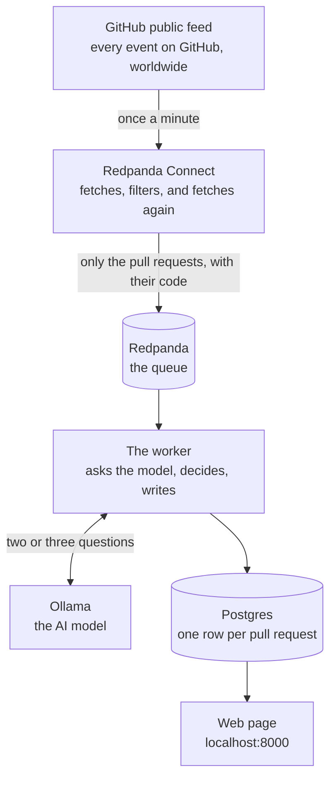

# PR Triage

This system watches for new pull requests on GitHub, reads the actual code that changed,
and sorts each one into a category (security, feature, refactor, docs or dependency
bump), adding a short risk note that a human can act upon. All of it lands on a web page.

It runs with a single command and it doesn't need any API key.



## The problem it solves

A large organisation generates hundreds of pull requests a day, and there's simply nobody
who can read all of them. Mostly they are routine, but a few of them will touch the login
system or the payment flow, and as of today those only get spotted by luck.

A simple rule can't find them either, due to titles being misleading. A pull request
titled "bump deps" can perfectly disable a token expiry check, and one titled "fix typo"
can open a security setting to the whole internet. In other words, the title tells you
what the author thought they were doing, while only the code tells you what they actually
did.

## Why this is not a trivial lookup

The reason being, GitHub's public feed gives you exactly five fields for a new pull
request:

```
id, number, url, base, head
```

No title, no description and no code, which means there's nothing in the feed a rule
could ever match against. So the pipeline has to go and fetch the title and the code by
itself before it can judge anything at all, and that fetching is the actual job here
rather than an extra step on top.

## Where to go next

| Page | What is in it |
|---|---|
| [Architecture](architecture.html) | Every component, what it does, where its code lives, and what would make it better |
| [Contracts](contracts.html) | The exact shapes each stage promises the next |
| [Repository](https://github.com/pablogd-hashi/rp-ghtriage) | Source, plus the README with the run instructions |

## Running it

```bash
git clone https://github.com/pablogd-hashi/rp-ghtriage.git
cd rp-ghtriage
cp .env.example .env
docker compose up
```

Then open <http://localhost:8000>. The first run downloads a model, so give it a few
minutes. The table is filled on boot from recorded results, which means it won't sit
empty while you wait for a live pull request to show up.

Full instructions, including the GitHub token and the monitoring stack, are in the
[README](https://github.com/pablogd-hashi/rp-ghtriage#readme).
