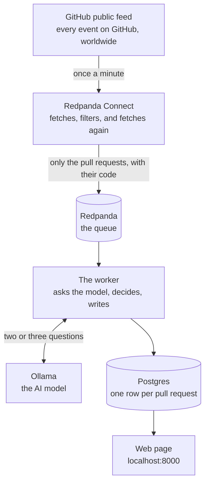

# PR Triage

This system watches for new pull requests on GitHub, reads the actual code that
changed, and sorts each one into a category: security, feature, refactor, docs, or
dependency bump. It writes a short note about what could break. The results show up on
a web page.

It runs with one command and needs no API keys.



## The problem it solves

A large organisation gets hundreds of pull requests a day and nobody can read them all.
Most are routine. A few touch the login system or payments. Today those get spotted by
luck.

A simple rule cannot find them, because **titles lie**. A pull request titled "bump
deps" can disable a token expiry check. One titled "fix typo" can open a security
setting to the whole internet. The title says what the author thought they did. Only
the code says what they did.

## Why this is not a trivial lookup

GitHub's public feed gives you five fields for a new pull request:

```
id, number, url, base, head
```

No title. No description. No code. There is nothing in the feed for a rule to match
against, so the pipeline has to go and fetch the title and the code before it can judge
anything. That fetching is the job, not an extra step.

## Where to go next

| Page | What is in it |
|---|---|
| [Architecture](architecture.html) | Every component, what it does, where its code is, and what would make it better |
| [Contracts](contracts.html) | The exact shapes each stage promises the next |
| [Repository](https://github.com/pablogd-hashi/rp-ghtriage) | Source, and the README with run instructions |

## Running it

```bash
git clone https://github.com/pablogd-hashi/rp-ghtriage.git
cd rp-ghtriage
cp .env.example .env
docker compose up
```

Then open <http://localhost:8000>. The first run downloads a model, so give it a few
minutes. The table is filled on boot from recorded results, so it is not empty while you
wait for a live pull request.

Full instructions, including the GitHub token and the monitoring stack, are in the
[README](https://github.com/pablogd-hashi/rp-ghtriage#readme).
